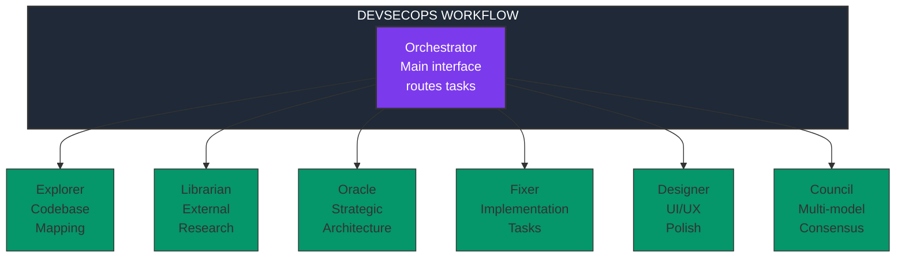
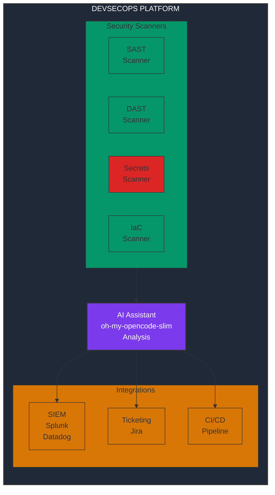


Always follow the principle of least privilege when configuring agent permissions. Never grant execute permissions to agents handling sensitive codebases without human approval gates.



Use ultra-cheap models (e.g., DeepSeek V4 Flash) for read-only tasks like exploration, and reserve frontier models for strategic decisions requiring deep analysis.


## System Design Patterns

### The Agent Pantheon in DevSecOps Context

When using **oh-my-opencode-slim**, each agent maps to specific DevSecOps responsibilities:



### Agent Responsibilities in DevSecOps

| Agent | DevSecOps Role | Typical Tasks |
|-------|---------------|---------------|
| **Orchestrator** | Security Coordinator | Task routing, context management, final decisions |
| **Explorer** | Asset Discovery | Map attack surface, find secrets, inventory IaC |
| **Librarian** | Threat Intel | CVE lookups, security advisory research, compliance docs |
| **Oracle** | Security Architect | Risk assessment, threat modeling, architecture review |
| **Fixer** | Remediation Engineer | Auto-patch vulnerabilities, update configs, refactor code |
| **Designer** | Security UX | Security dashboards, alert interfaces, documentation |
| **Council** | Red Team Consensus | Multi-model security validation, attack simulation |

## Workflow Patterns

### Pattern 1: Continuous Security Assessment

```mermaid
flowchart LR
    subgraph Trigger["Trigger: Code push or schedule"]
        direction LR
        T[Start]
    end
    
    T --> E[Explorer<br/>Map codebase<br/>changes]
    E --> |Identify new files<br/>dependencies<br/>configurations| Or[Oracle<br/>Assess risk]
    Or --> |Analyze attack surface<br/>Prioritize concerns| L[Librarian<br/>Research<br/>threats]
    L --> |Check CVEs<br/>Review advisories| F[Fixer<br/>Auto-remediate<br/>if safe]
    F --> |Update deps<br/>Apply patches<br/>Refactor| C[Council<br/>Validate<br/>high-risk]
    C --> |Multi-model review<br/>Consensus| End[End]
    
    style Trigger fill:#1f2937,stroke:#333,stroke-width:2px,color:#fff
    style E fill:#059669,stroke:#333,stroke-width:1px
    style Or fill:#d97706,stroke:#333,stroke-width:1px
    style L fill:#059669,stroke:#333,stroke-width:1px
    style F fill:#dc2626,stroke:#333,stroke-width:1px
    style C fill:#7c3aed,stroke:#333,stroke-width:1px
    style End fill:#1f2937,stroke:#333,stroke-width:1px
```



### Pattern 2: Incident Response

```mermaid
flowchart LR
    subgraph Trigger["Trigger: Security alert or breach"]
        direction LR
        T[Start]
    end
    
    T --> E[Explorer<br/>Immediate<br/>reconnaissance]
    E --> |Find affected<br/>systems<br/>Map blast radius| L[Librarian<br/>Rapid<br/>research]
    L --> |Look up<br/>attack vectors<br/>Find mitigations| Or[Oracle<br/>Strategic<br/>response]
    Or --> |Assess containment<br/>Plan remediation| F[Fixer<br/>Execute<br/>fixes]
    F --> |Apply patches<br/>Update rules<br/>Rotate creds| D[Designer<br/>Document<br/>incident]
    D --> |Create timeline<br/>Generate template| End[End]
    
    style Trigger fill:#1f2937,stroke:#333,stroke-width:2px,color:#fff
    style E fill:#dc2626,stroke:#333,stroke-width:2px,color:#fff
    style L fill:#dc2626,stroke:#333,stroke-width:1px
    style Or fill:#d97706,stroke:#333,stroke-width:1px
    style F fill:#dc2626,stroke:#333,stroke-width:1px
    style D fill:#059669,stroke:#333,stroke-width:1px
    style End fill:#1f2937,stroke:#333,stroke-width:1px
```



### Pattern 3: Compliance Automation

```mermaid
flowchart LR
    subgraph Trigger["Trigger: Audit requirement or policy update"]
        direction LR
        T[Start]
    end
    
    T --> L[Librarian<br/>Research<br/>standards]
    L --> |Fetch requirements<br/>Map to controls| E[Explorer<br/>Find<br/>evidence]
    E --> |Scan IaC<br/>Document state| Or[Oracle<br/>Gap<br/>analysis]
    Or --> |Compare current<br/>vs required<br/>Prioritize| F[Fixer<br/>Implement<br/>controls]
    F --> |Add security<br/>controls<br/>Update policies| C[Council<br/>Validate<br/>compliance]
    C --> |Multi-model<br/>review posture| End[End]
    
    style Trigger fill:#1f2937,stroke:#333,stroke-width:2px,color:#fff
    style L fill:#059669,stroke:#333,stroke-width:1px
    style E fill:#059669,stroke:#333,stroke-width:1px
    style Or fill:#d97706,stroke:#333,stroke-width:1px
    style F fill:#059669,stroke:#333,stroke-width:1px
    style C fill:#7c3aed,stroke:#333,stroke-width:1px
    style End fill:#1f2937,stroke:#333,stroke-width:1px
```



## Integration Architecture

### With Existing DevSecOps Toolchain



### Data Flow Security

```mermaid
flowchart LR
    subgraph Input["User Input"]
        direction LR
        UI[User<br/>Input]
    end
    
    subgraph Filter1["Local Filter"]
        direction TB
        F1[.gitignore<br/>Patterns<br/>PII Filter]
    end
    
    subgraph AI["AI Assistant"]
        direction TB
        A[oh-my-opencode-slim<br/>Analysis]
    end
    
    subgraph Filter2["Local Sanitization"]
        direction TB
        F2[Command<br/>Review<br/>Human]
    end
    
    subgraph Output["Output"]
        direction LR
        O[Output]
    end
    
    UI --> F1 --> A --> F2 --> O
    
    style Input fill:#1f2937,stroke:#333,stroke-width:1px
    style UI fill:#059669,stroke:#333,stroke-width:1px
    style Filter1 fill:#d97706,stroke:#333,stroke-width:1px
    style F1 fill:#d97706,stroke:#333,stroke-width:1px
    style AI fill:#7c3aed,stroke:#333,stroke-width:2px,color:#fff
    style A fill:#7c3aed,stroke:#333,stroke-width:2px,color:#fff
    style Filter2 fill:#d97706,stroke:#333,stroke-width:1px
    style F2 fill:#d97706,stroke:#333,stroke-width:1px
    style Output fill:#1f2937,stroke:#333,stroke-width:1px
    style O fill:#059669,stroke:#333,stroke-width:1px
```



## Configuration Architecture

### Multi-Provider Cost Optimization

```json
{
  "agents": {
    "orchestrator": {
      "model": "openai/gpt-5.4",
      "purpose": "Strategic decisions, complex security analysis"
    },
    "explorer": {
      "model": "cerebras/zai-glm-4.7",
      "purpose": "Fast codebase scanning, low cost"
    },
    "oracle": {
      "model": "openai/gpt-5.4 (high)",
      "purpose": "Deep security architecture review"
    },
    "librarian": {
      "model": "openai/gpt-5.4-mini",
      "purpose": "Documentation lookups, CVE research"
    },
    "fixer": {
      "model": "fireworks-ai/kimi-k2p5-turbo",
      "purpose": "Fast implementation, routine fixes"
    },
    "council": {
      "models": ["openai/gpt-5.4", "anthropic/claude-3.5-sonnet", "google/gemini-1.5-pro"],
      "purpose": "Multi-model consensus on critical security decisions"
    }
  }
}
```

## MCP (Model Context Protocol) Integration

### Security-Focused MCP Servers

```json
{
  "mcpServers": {
    "security-advisories": {
      "type": "stdio",
      "command": "npx",
      "args": ["-y", "@security/mcp-advisories"]
    },
    "github-security": {
      "type": "http",
      "url": "https://api.github.com/advisories",
      "auth": "${GITHUB_TOKEN}"
    },
    "terraform-docs": {
      "type": "stdio",
      "command": "npx",
      "args": ["-y", "@hashicorp/mcp-terraform"]
    },
    "kubernetes-api": {
      "type": "stdio",
      "command": "kubectl",
      "args": ["mcp-server"]
    }
  }
}
```

## Scalability Patterns

### From Individual to Enterprise

| Scale | Pattern | Tools |
|-------|---------|-------|
| **Individual** | Local CLI + local models | ShellGPT + Ollama |
| **Team** | Shared configs + centralized policies | oh-my-opencode-slim + shared git repo |
| **Enterprise** | Federated agents + governance layer | Custom orchestration + audit logging |

### Session Management at Scale

```yaml
# Enterprise session patterns
sessions:
  security-audit:
    retention: 90_days
    logging: required
    approval: security_lead
  
  incident-response:
    retention: 1_year
    logging: required
    approval: auto
    
  routine-ops:
    retention: 7_days
    logging: optional
    approval: none
```

## Anti-Patterns to Avoid

1. **The "Yolo" Mode**: Never use `--yolo` or equivalent in production
2. **Over-Delegation**: Don't route trivial tasks through complex multi-agent flows
3. **Context Bleed**: Isolate sensitive and non-sensitive contexts
4. **Model Over-Reliance**: Always have human review for security-critical changes
5. **Audit Blindness**: Never disable logging for security workflows
