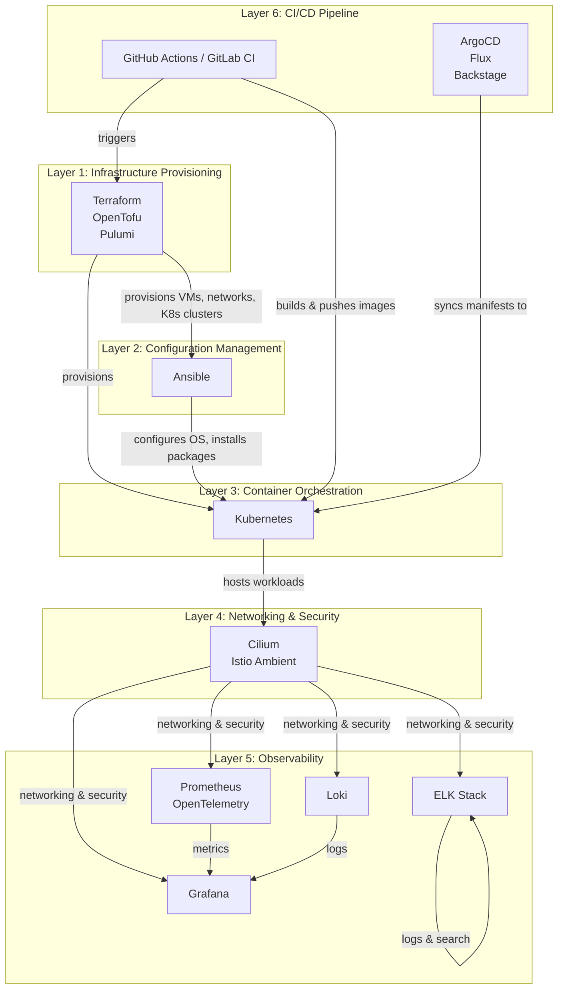
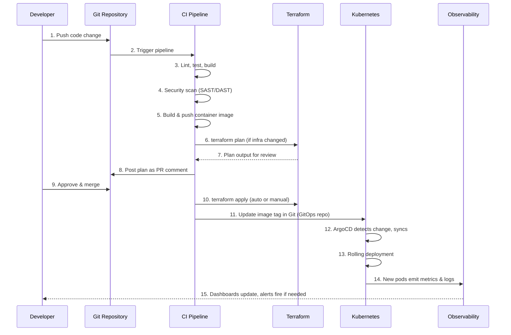
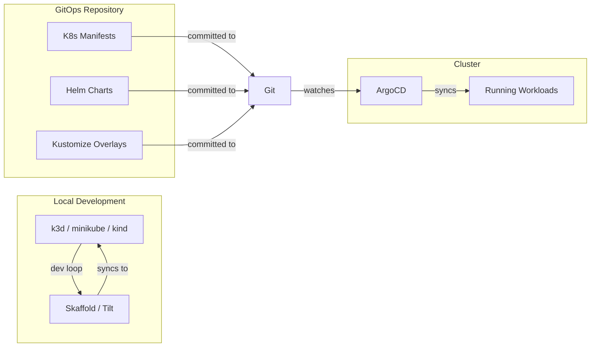
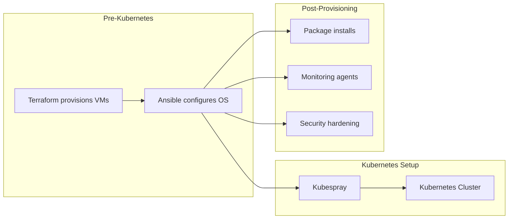
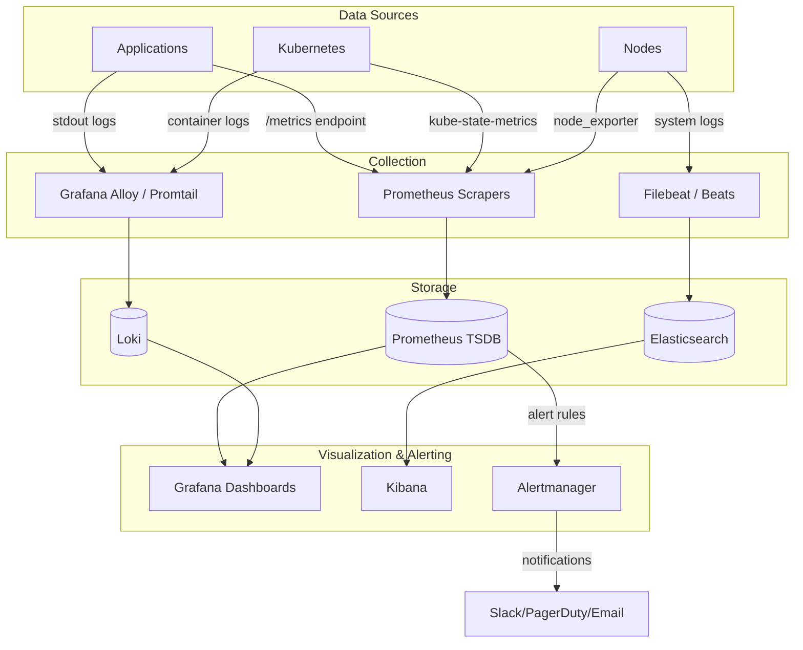
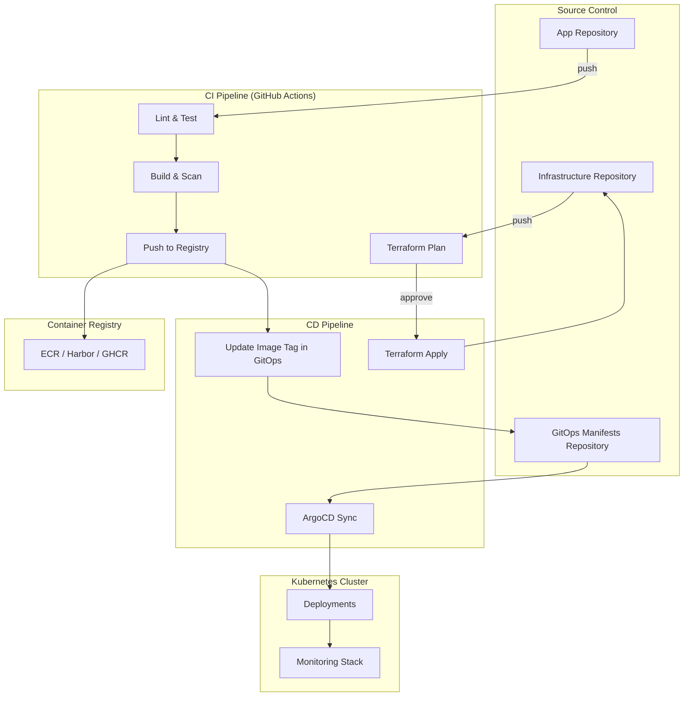
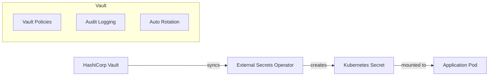
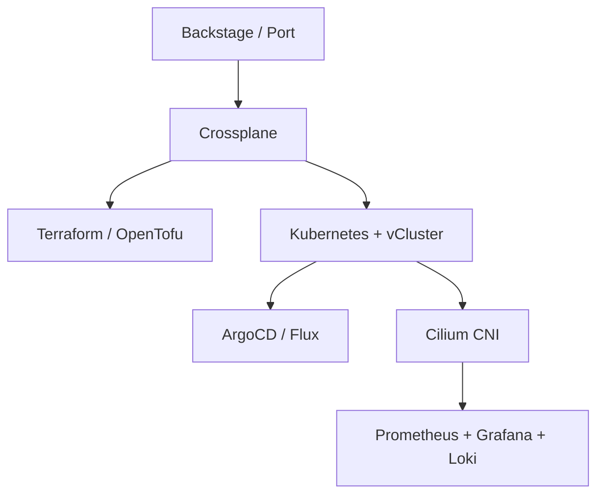

# Modern DevOps Stack: Comprehensive Developer Workflow Guide

> **Stack**: Terraform · Kubernetes · Ansible · Prometheus + Grafana + Loki + ELK

---

## Table of Contents

1. [Stack Overview](#1-stack-overview)
2. [2026 DevOps Tools Landscape](#2026-devops-tools-landscape)
3. [Developer Daily Workflow](#2-developer-daily-workflow)
4. [Terraform Workflow](#3-terraform-workflow)
5. [Kubernetes Workflow](#4-kubernetes-workflow)
6. [Ansible Workflow](#5-ansible-workflow)
7. [Observability Workflow](#6-observability-workflow)
8. [CI/CD Integration](#7-cicd-integration)
9. [Security Considerations](#8-security-considerations)
10. [AI Assistant Integration](#9-ai-assistant-integration)
11. [Platform Engineering & IDP](#10-platform-engineering--idp)

---

## 1. Stack Overview

### How These Tools Work Together

This stack represents a complete infrastructure-to-observability pipeline. Each tool occupies a distinct layer in the DevOps hierarchy:



### Tool Responsibilities

| Tool | Layer | Primary Responsibility | Key Strength |
|------|-------|----------------------|--------------|
| **Terraform** | Infrastructure | Provision cloud resources (VPCs, EKS, RDS, IAM) | Declarative state management, dependency resolution |
| **Ansible** | Configuration | OS-level configuration, package management, pre-K8s setup | Agentless, idempotent, human-readable playbooks |
| **Kubernetes** | Orchestration | Container scheduling, scaling, self-healing | Declarative desired state, ecosystem richness |
| **Prometheus** | Metrics | Time-series metrics collection & alerting | Pull-based model, PromQL, Kubernetes-native |
| **Grafana** | Visualization | Unified dashboards for metrics, logs, traces | Multi-data-source, rich visualization |
| **Loki** | Logs | Lightweight log aggregation (labels-only indexing) | Cost-efficient, integrates with Prometheus |
| **ELK Stack** | Logs & Search | Full-text log search, analysis, visualization | Powerful search, Kibana dashboards, Beats ecosystem |

### When to Use Loki vs. ELK

| Criteria | Loki + Grafana | ELK Stack |
|----------|---------------|-----------|
| **Indexing** | Labels only (like Prometheus) | Full-text (every field indexed) |
| **Storage Cost** | Low (compressed, minimal index) | Higher (full inverted index) |
| **Query Language** | LogQL (similar to PromQL) | Lucene / KQL |
| **Best For** | Kubernetes-native, cost-conscious | Full-text search, compliance, SIEM |
| **Integration** | Native Grafana experience | Kibana ecosystem, Beats shippers |
| **Scale** | Excellent for high-volume K8s logs | Requires more resources at scale |

> **Recommendation**: Use **Loki + Grafana** for Kubernetes-native observability (tighter integration, lower cost). Use **ELK** when you need full-text search, compliance reporting, or SIEM capabilities. Many teams run both — Loki for operational debugging, ELK for compliance and deep analysis.

---

## 2026 DevOps Tools Landscape

> The DevOps tooling landscape has evolved significantly. Here's what's leading in 2026.

### IaC in 2026

| Tool | Status | Best For |
|------|--------|----------|
| **Terraform** | Leading (incumbent) | Largest ecosystem, HCP Terraform AI integration |
| **OpenTofu** | Emerging → Leading | Default for new HCL projects, CNCF Sandbox, state encryption |
| **Pulumi** | Growing rapidly | Developer-first teams, real programming languages, Pulumi Neo AI agent |
| **Crossplane** | Leading (K8s-native) | Platform engineering, self-service cloud resources as CRDs |

### Kubernetes & Platform Engineering

| Tool | Status | Best For |
|------|--------|----------|
| **Backstage** | Leading IDP (89% share) | Large orgs with dedicated platform teams |
| **Port** | Fastest growing | Mid-size orgs, 2-4 week time-to-value |
| **ArgoCD** | Leading GitOps (60% share) | Multi-cluster, UI-driven GitOps |
| **vCluster** | Emerging hot trend | Multi-tenancy, 50% cost savings |
| **Cilium** | Emerging → Leading | eBPF-based networking, zero sidecar service mesh |

### Observability in 2026

| Tool | Status | Role |
|------|--------|------|
| **OpenTelemetry** | The standard | Unified instrumentation (76% orgs investing) |
| **Prometheus** | Leading metrics | Still the metrics backbone |
| **Grafana Alloy** | Leading collector | Replaced Grafana Agent, unified telemetry collection |
| **Pyroscope/Parca** | Emerging | Continuous profiling (4th pillar of observability) |

### Security / DevSecOps in 2026

| Tool | Status | Role |
|------|--------|------|
| **Trivy** | Leading scanner | All-in-one: images, IaC, secrets, licenses |
| **Falco** | Leading runtime | eBPF kernel-level threat detection |
| **Kubescape** | Growing | Full K8s security lifecycle, CNCF Incubating |
| **Kyverno** | Leading policy | K8s-native, YAML-based (easier than OPA/Rego) |
| **Cosign/Sigstore** | Leading signing | Keyless image signing |
| **Tetragon** | Emerging | eBPF runtime security + enforcement |

### AI-Native DevOps Tools (New in 2026)

| Tool | Category | What It Does |
|------|----------|--------------|
| **Pulumi Neo** | AI Infra Agent | Natural language → infrastructure provisioning |
| **Komodor (Klaudia AI)** | AI SRE | Autonomous K8s troubleshooting, 80% MTTR reduction |
| **Harness Agents** | AI Pipeline Workers | Autonomous CI/CD workers, autofix builds |
| **Plural** | AI K8s Control Plane | AI agents for Terraform + K8s remediation |

### Key 2026 Trends

1. **Platform engineering is mandatory** — 90% of orgs have IDPs
2. **eBPF is winning** — Cilium dominates networking; Tetragon/Falco for security
3. **OpenTelemetry won instrumentation** — vendor-specific agents are legacy
4. **Agentic AI is the new frontier** — autonomous agents executing real changes
5. **Sidecar-less service mesh** — Istio Ambient + Cilium replacing traditional sidecars
6. **Open-source governance matters** — OpenTofu, CNCF projects gaining trust over BSL licenses

---

## 2. Developer Daily Workflow

### End-to-End Flow: Code Change to Production



### Daily Developer Checklist

| Time | Activity | Tools Used |
|------|----------|-----------|
| **Morning** | Check Grafana dashboards for overnight alerts | Grafana, Alertmanager, Slack |
| | Review Loki/ELK logs for errors | Grafana Explore, Kibana |
| **Development** | Write code, run local tests | IDE, Docker, k3d/minikube |
| | Test infrastructure changes locally | `terraform plan`, `terraform validate` |
| **Code Review** | Push branch, open PR | GitHub/GitLab |
| | Review CI pipeline results | CI dashboard |
| | Review Terraform plan output | PR comment |
| **Deployment** | Merge to main (triggers deploy) | Git |
| | Monitor ArgoCD sync status | ArgoCD UI |
| | Verify deployment health | `kubectl get pods`, Grafana |
| **Post-Deploy** | Monitor metrics for anomalies | Grafana, Prometheus |
| | Check logs for errors | Loki, ELK |
| | Respond to alerts if any | Alertmanager, PagerDuty |

---

## 3. Terraform Workflow

### 3.1 Project Structure

```
infrastructure/
├── environments/
│   ├── dev/
│   │   ├── main.tf
│   │   ├── variables.tf
│   │   ├── outputs.tf
│   │   └── terraform.tfvars
│   ├── staging/
│   │   └── ...
│   └── prod/
│       └── ...
├── modules/
│   ├── vpc/
│   │   ├── main.tf
│   │   ├── variables.tf
│   │   └── outputs.tf
│   ├── eks/
│   │   └── ...
│   └── rds/
│       └── ...
└── backend.tf
```

### 3.2 State Management

**Remote Backend Configuration** (using S3 + DynamoDB for locking):

```hcl
# backend.tf
terraform {
  backend "s3" {
    bucket         = "my-terraform-state-bucket"
    key            = "infrastructure/prod/terraform.tfstate"
    region         = "us-east-1"
    dynamodb_table = "terraform-locks"
    encrypt        = true
  }
}
```

> **Critical**: Never store Terraform state locally in team environments. State files contain sensitive data (resource IDs, sometimes secrets) and must be shared safely with locking to prevent concurrent modifications.

### 3.3 Workspaces vs. Directory-per-Environment

| Approach | Pros | Cons | Best For |
|----------|------|------|----------|
| **Workspaces** | Single config, easy switching | Shared code = risk of cross-env changes | Simple setups, identical environments |
| **Directory-per-env** | Full isolation, different configs per env | Code duplication risk | Production-grade, compliance requirements |

**Recommended**: Use **directory-per-environment** for production. Workspaces are better suited for ephemeral environments (feature branches, sandboxes).

```bash
# Workspace approach (for ephemeral envs)
terraform workspace new feature-branch-xyz
terraform workspace select feature-branch-xyz
terraform apply

# Use workspace name in resource naming
module "eks" {
  name_prefix = "app-${terraform.workspace}"
  # ...
}
```

### 3.4 Module Best Practices

```hcl
# modules/eks/main.tf
variable "cluster_name" {
  type        = string
  description = "Name of the EKS cluster"
}

variable "node_count" {
  type        = number
  description = "Number of worker nodes"
  default     = 3
}

variable "instance_type" {
  type        = string
  default     = "t3.medium"
}

output "cluster_endpoint" {
  value       = aws_eks_cluster.main.endpoint
  description = "EKS cluster API endpoint"
}

output "cluster_security_group_id" {
  value       = aws_eks_cluster.main.vpc_config[0].cluster_security_group_id
  description = "Security group ID for the cluster"
}
```

### 3.5 CI/CD Integration

**GitHub Actions Workflow** (based on [hashicorp/setup-terraform](https://github.com/hashicorp/setup-terraform) and [actions/starter-workflows](https://github.com/actions/starter-workflows/blob/main/deployments/terraform.yml)):

```yaml
# .github/workflows/terraform.yml
name: Terraform

on:
  push:
    branches: [main]
    paths: ['infrastructure/**']
  pull_request:
    branches: [main]
    paths: ['infrastructure/**']

env:
  TF_WORKSPACE: ${{ github.ref == 'refs/heads/main' && 'prod' || 'dev' }}

jobs:
  terraform:
    name: Terraform
    runs-on: ubuntu-latest
    defaults:
      run:
        working-directory: infrastructure/environments/${{ env.TF_WORKSPACE }}

    steps:
      - name: Checkout
        uses: actions/checkout@v4

      - name: Setup Terraform
        uses: hashicorp/setup-terraform@v3
        with:
          terraform_version: 1.9.0

      - name: Configure AWS Credentials
        uses: aws-actions/configure-aws-credentials@v4
        with:
          role-to-assume: ${{ secrets.AWS_ROLE_ARN }}
          aws-region: us-east-1

      - name: Terraform Init
        run: terraform init

      - name: Terraform Format Check
        run: terraform fmt -check -recursive

      - name: Terraform Validate
        run: terraform validate

      - name: Terraform Plan
        if: github.event_name == 'pull_request'
        run: terraform plan -input=false -out=tfplan
        env:
          TF_VAR_environment: ${{ env.TF_WORKSPACE }}

      - name: Post Plan as PR Comment
        if: github.event_name == 'pull_request'
        uses: actions/github-script@v7
        with:
          script: |
            const plan = require('fs').readFileSync('tfplan', 'utf8');
            github.rest.issues.createComment({
              issue_number: context.issue.number,
              owner: context.repo.owner,
              repo: context.repo.repo,
              body: '```\\n' + plan + '\\n```'
            });

      - name: Terraform Apply
        if: github.ref == 'refs/heads/main' && github.event_name == 'push'
        run: terraform apply -auto-approve tfplan
        env:
          TF_VAR_environment: ${{ env.TF_WORKSPACE }}
```

### 3.6 Essential Terraform Commands

| Command | Purpose | When to Use |
|---------|---------|-------------|
| `terraform init` | Initialize backend & providers | After cloning, adding providers |
| `terraform fmt -check` | Validate formatting | In CI, pre-commit hooks |
| `terraform validate` | Check config syntax | Before plan, in CI |
| `terraform plan` | Preview changes | Before every apply |
| `terraform apply` | Execute changes | After plan review |
| `terraform destroy` | Remove all resources | Cleanup, teardown |
| `terraform state list` | List tracked resources | Debugging state issues |
| `terraform import` | Import existing resources | Migrating to Terraform |

---

## 4. Kubernetes Workflow

### 4.1 Developer Interaction Patterns



### 4.2 kubectl Essential Commands

```bash
# Cluster info & context
kubectl config get-contexts
kubectl config use-context my-cluster
kubectl cluster-info

# Workload management
kubectl get pods -n <namespace>
kubectl get deployments -n <namespace>
kubectl get services -n <namespace>
kubectl get ingress -n <namespace>

# Debugging
kubectl logs -f <pod-name> -n <namespace>
kubectl logs -f <pod-name> -c <container-name> -n <namespace>
kubectl describe pod <pod-name> -n <namespace>
kubectl exec -it <pod-name> -n <namespace> -- /bin/sh

# Resource management
kubectl apply -f deployment.yaml
kubectl delete -f deployment.yaml
kubectl rollout status deployment/<name> -n <namespace>
kubectl rollout undo deployment/<name> -n <namespace>

# Dry-run for validation
kubectl apply -f deployment.yaml --dry-run=client -o yaml
kubectl create deployment my-app --image=myapp:latest --dry-run=server -o yaml > deployment.yaml
```

### 4.3 Helm Workflow

**Install kube-prometheus-stack** (from real-world usage):

```bash
# Add repository
helm repo add prometheus-community https://prometheus-community.github.io/helm-charts
helm repo update

# Install with custom values
helm upgrade --install monitoring prometheus-community/kube-prometheus-stack \
  --namespace monitoring --create-namespace \
  -f values-prod.yaml \
  --timeout 10m --wait
```

**Helm Chart Structure**:

```
charts/my-app/
├── Chart.yaml          # Chart metadata
├── values.yaml         # Default values
├── values-dev.yaml     # Dev overrides
├── values-prod.yaml    # Prod overrides
└── templates/
    ├── deployment.yaml
    ├── service.yaml
    ├── ingress.yaml
    ├── configmap.yaml
    ├── secret.yaml
    ├── serviceaccount.yaml
    ├── servicemonitor.yaml   # Prometheus integration
    └── _helpers.tpl          # Template helpers
```

### 4.4 GitOps with ArgoCD

**ArgoCD Application Manifest**:

```yaml
apiVersion: argoproj.io/v1alpha1
kind: Application
metadata:
  name: my-app
  namespace: argocd
spec:
  project: default
  source:
    repoURL: https://github.com/org/k8s-manifests.git
    targetRevision: main
    path: apps/my-app/overlays/prod
  destination:
    server: https://kubernetes.default.svc
    namespace: my-app
  syncPolicy:
    automated:
      prune: true
      selfHeal: true
    syncOptions:
      - CreateNamespace=true
      - PrunePropagationPolicy=foreground
```

**GitOps Directory Structure**:

```
k8s-manifests/
├── base/
│   ├── deployment.yaml
│   ├── service.yaml
│   └── kustomization.yaml
├── overlays/
│   ├── dev/
│   │   ├── kustomization.yaml
│   │   └── replicas-patch.yaml
│   ├── staging/
│   │   └── ...
│   └── prod/
│       ├── kustomization.yaml
│       └── resource-limits-patch.yaml
└── apps/
    ├── my-app/
    │   └── overlays/
    └── monitoring/
        └── overlays/
```

### 4.5 Kubernetes Manifest Best Practices

```yaml
apiVersion: apps/v1
kind: Deployment
metadata:
  name: my-app
  namespace: my-app
  labels:
    app: my-app
    version: v1.2.3
spec:
  replicas: 3
  selector:
    matchLabels:
      app: my-app
  strategy:
    type: RollingUpdate
    rollingUpdate:
      maxSurge: 1
      maxUnavailable: 0
  template:
    metadata:
      labels:
        app: my-app
        version: v1.2.3
      annotations:
        prometheus.io/scrape: "true"
        prometheus.io/port: "8080"
        prometheus.io/path: "/metrics"
    spec:
      serviceAccountName: my-app-sa
      securityContext:
        runAsNonRoot: true
        runAsUser: 1000
        fsGroup: 2000
      containers:
        - name: my-app
          image: myregistry/my-app:v1.2.3
          ports:
            - containerPort: 8080
              protocol: TCP
          resources:
            requests:
              cpu: 100m
              memory: 128Mi
            limits:
              cpu: 500m
              memory: 512Mi
          readinessProbe:
            httpGet:
              path: /healthz
              port: 8080
            initialDelaySeconds: 5
            periodSeconds: 10
          livenessProbe:
            httpGet:
              path: /healthz
              port: 8080
            initialDelaySeconds: 15
            periodSeconds: 20
          envFrom:
            - configMapRef:
                name: my-app-config
            - secretRef:
                name: my-app-secrets
```

### 4.6 Modern Kubernetes Networking (2026)

In 2026, **Cilium** has become the leading CNI for cloud-native environments:

- **eBPF-based**: Kernel-level packet processing for superior performance
- **Zero-trust security**: Network policies enforced at the kernel level
- **Sidecar-less service mesh**: Istio Ambient mode integrates with Cilium for mesh capabilities without sidecar overhead
- ** Hubble**: Built-in observability for network flow visualization

**vCluster** is the emerging standard for multi-tenancy:

- Virtual Kubernetes clusters running on top of physical clusters
- 50% cost savings vs. dedicated clusters
- Full isolation for team or customer separation
- Works with any CNI (including Cilium)

```bash
# Install Cilium via Helm
helm repo add cilium https://helm.cilium.io/
helm install cilium cilium/cilium --namespace kube-system

# Create a vCluster
vcluster create my-vcluster -n namespace
```

---

## 5. Ansible Workflow

### 5.1 Where Ansible Fits in the Stack



**Ansible is used for**:
- **Pre-provisioning**: OS hardening, package installation, user management on VMs before K8s
- **K8s cluster bootstrapping**: Kubespray for bare-metal/self-managed Kubernetes
- **Post-provisioning**: Installing monitoring agents (node_exporter), configuring NTP, setting up log shippers
- **Golden images**: Packer + Ansible for building pre-configured VM images

### 5.2 Ansible Project Structure

```
ansible/
├── ansible.cfg
├── inventory/
│   ├── production/
│   │   ├── hosts.yml
│   │   └── group_vars/
│   │       ├── all.yml
│   │       ├── k8s-masters.yml
│   │       └── k8s-workers.yml
│   └── staging/
│       └── ...
├── playbooks/
│   ├── site.yml              # Main playbook
│   ├── k8s-bootstrap.yml
│   ├── monitoring-setup.yml
│   └── security-hardening.yml
├── roles/
│   ├── common/
│   │   ├── tasks/
│   │   ├── handlers/
│   │   ├── templates/
│   │   └── defaults/
│   ├── docker/
│   ├── node-exporter/
│   ├── promtail/
│   └── security/
└── requirements.yml          # Galaxy dependencies
```

### 5.3 Playbook Examples

**Site-wide deployment playbook**:

```yaml
# playbooks/site.yml
---
# Apply common configuration to all hosts
- hosts: all
  become: true
  roles:
    - common
    - security

# Configure Kubernetes masters
- hosts: k8s-masters
  become: true
  roles:
    - docker
    - kubernetes-master

# Configure Kubernetes workers
- hosts: k8s-workers
  become: true
  roles:
    - docker
    - kubernetes-worker

# Deploy monitoring agents
- hosts: k8s-all
  become: true
  roles:
    - node-exporter
    - promtail
```

**Monitoring setup role**:

```yaml
# roles/node-exporter/tasks/main.yml
---
- name: Install node_exporter
  ansible.builtin.apt:
    name: prometheus-node-exporter
    state: present
    update_cache: true

- name: Ensure node_exporter is running
  ansible.builtin.service:
    name: node_exporter
    state: started
    enabled: true

- name: Configure firewall for node_exporter
  ansible.builtin.ufw:
    rule: allow
    port: "9100"
    proto: tcp
```

### 5.4 Ansible CI/CD Integration

```yaml
# .github/workflows/ansible.yml
name: Ansible

on:
  push:
    paths: ['ansible/**']
  pull_request:
    paths: ['ansible/**']

jobs:
  lint:
    runs-on: ubuntu-latest
    steps:
      - uses: actions/checkout@v4

      - name: Lint Ansible Playbooks
        uses: ansible/ansible-lint@v26
        with:
          args: ansible/playbooks/

  test:
    runs-on: ubuntu-latest
    needs: lint
    steps:
      - uses: actions/checkout@v4

      - name: Setup Python
        uses: actions/setup-python@v5
        with:
          python-version: '3.12'

      - name: Install Ansible
        run: pip install ansible

      - name: Syntax Check
        run: ansible-playbook --syntax-check -i ansible/inventory/staging/hosts.yml ansible/playbooks/site.yml

      - name: Dry Run
        run: ansible-playbook --check -i ansible/inventory/staging/hosts.yml ansible/playbooks/site.yml
```

### 5.5 Terraform + Ansible Integration

```hcl
# Terraform triggers Ansible after provisioning
resource "null_resource" "ansible_provision" {
  triggers = {
    instance_ids = join(",", aws_instance.k8s[*].id)
  }

  provisioner "local-exec" {
    command = <<-EOT
      ANSIBLE_HOST_KEY_CHECKING=False \
      ansible-playbook \
        -i '${join("\n", aws_instance.k8s[*].public_ip)},' \
        --private-key ${var.ssh_private_key_path} \
        -u ubuntu \
        ansible/playbooks/site.yml
    EOT
  }

  depends_on = [aws_instance.k8s]
}
```

> **Note**: For production, prefer triggering Ansible from CI/CD rather than Terraform provisioners. This separates concerns and provides better audit trails.

---

## 6. Observability Workflow

> **2026 Update**: **OpenTelemetry** has become the universal standard for instrumentation. 76% of organizations are investing in OTel, and vendor-specific agents are now considered legacy. **Grafana Alloy** has replaced Grafana Agent as the unified telemetry collector.

### 6.1 Architecture Overview



### 6.2 Metrics: Prometheus + Grafana

#### Deployment via Helm

```bash
# Install kube-prometheus-stack (bundles Prometheus, Grafana, Alertmanager)
helm repo add prometheus-community https://prometheus-community.github.io/helm-charts
helm repo update

helm upgrade --install monitoring prometheus-community/kube-prometheus-stack \
  --namespace monitoring --create-namespace \
  -f kube-prometheus-values.yaml
```

#### Custom Values Configuration

```yaml
# kube-prometheus-values.yaml
prometheus:
  prometheusSpec:
    retention: 15d
    resources:
      requests:
        memory: 2Gi
        cpu: 500m
      limits:
        memory: 4Gi
        cpu: 2000m
    serviceMonitorSelectorNilUsesHelmValues: false
    podMonitorSelectorNilUsesHelmValues: false

grafana:
  enabled: true
  adminPassword: ${GRAFANA_ADMIN_PASSWORD}
  sidecar:
    dashboards:
      enabled: true
      label: grafana_dashboard
    datasources:
      enabled: true
  dashboardProviders:
    dashboardproviders.yaml:
      apiVersion: 1
      providers:
        - name: 'default'
          orgId: 1
          folder: ''
          type: file
          disableDeletion: false
          editable: true
          options:
            path: /var/lib/grafana/dashboards/default

alertmanager:
  config:
    global:
      resolve_timeout: 5m
      slack_api_url: '${SLACK_WEBHOOK_URL}'
    route:
      group_by: ['alertname', 'namespace']
      group_wait: 30s
      group_interval: 5m
      repeat_interval: 4h
      receiver: 'slack-notifications'
      routes:
        - match:
            severity: critical
          receiver: 'pagerduty-critical'
        - match:
            severity: warning
          receiver: 'slack-notifications'
    receivers:
      - name: 'slack-notifications'
        slack_configs:
          - channel: '#alerts'
            send_resolved: true
            title: '{{ .GroupLabels.alertname }}'
            text: '{{ range .Alerts }}{{ .Annotations.summary }}{{ end }}'
      - name: 'pagerduty-critical'
        pagerduty_configs:
          - service_key: '${PAGERDUTY_SERVICE_KEY}'
```

#### ServiceMonitor for Application Metrics

```yaml
apiVersion: monitoring.coreos.com/v1
kind: ServiceMonitor
metadata:
  name: my-app-monitor
  namespace: monitoring
  labels:
    release: monitoring
spec:
  selector:
    matchLabels:
      app: my-app
  endpoints:
    - port: http
      path: /metrics
      interval: 15s
  namespaceSelector:
    matchNames:
      - my-app
```

#### Prometheus Alerting Rules

```yaml
apiVersion: monitoring.coreos.com/v1
kind: PrometheusRule
metadata:
  name: my-app-alerts
  namespace: monitoring
  labels:
    release: monitoring
spec:
  groups:
    - name: my-app.rules
      rules:
        - alert: HighErrorRate
          expr: |
            sum(rate(http_requests_total{job="my-app",status=~"5.."}[5m]))
            /
            sum(rate(http_requests_total{job="my-app"}[5m]))
            > 0.05
          for: 5m
          labels:
            severity: critical
          annotations:
            summary: "High error rate on {{ $labels.instance }}"
            description: "Error rate is {{ $value | humanizePercentage }} (threshold: 5%)"

        - alert: HighMemoryUsage
          expr: |
            container_memory_usage_bytes{namespace="my-app"}
            /
            container_spec_memory_limit_bytes{namespace="my-app"}
            > 0.9
          for: 10m
          labels:
            severity: warning
          annotations:
            summary: "High memory usage in {{ $labels.pod }}"
            description: "Memory usage is {{ $value | humanizePercentage }} of limit"

        - alert: PodCrashLooping
          expr: |
            rate(kube_pod_container_status_restarts_total{namespace="my-app"}[15m])
            > 0
          for: 15m
          labels:
            severity: warning
          annotations:
            summary: "Pod {{ $labels.pod }} is crash looping"
```

### 6.3 Logs: Loki + Grafana

#### Loki Deployment

```yaml
# loki-values.yaml
loki:
  commonConfig:
    replication_factor: 1
  storage:
    type: filesystem
  schemaConfig:
    configs:
      - from: "2024-01-01"
        store: tsdb
        object_store: filesystem
        schema: v13
        index:
          prefix: loki_index_
          period: 24h

promtail:
  enabled: true
  config:
    clients:
      - url: http://loki:3100/loki/api/v1/push
```

#### Grafana Alloy Configuration (modern replacement for Promtail)

```alloy
// alloy-config.alloy
discovery.kubernetes "pods" {
  role = "pod"
}

discovery.relabel "kubernetes_pods" {
  targets = discovery.kubernetes.pods.targets

  rule {
    source_labels = ["__meta_kubernetes_namespace"]
    target_label  = "namespace"
  }

  rule {
    source_labels = ["__meta_kubernetes_pod_name"]
    target_label  = "pod"
  }

  rule {
    source_labels = ["__meta_kubernetes_pod_container_name"]
    target_label  = "container"
  }
}

loki.source.kubernetes "pods" {
  targets    = discovery.relabel.kubernetes_pods.output
  forward_to = [loki.write.loki.receiver]
}

loki.write "loki" {
  endpoint {
    url = "http://loki:3100/loki/api/v1/push"
  }
}
```

#### LogQL Query Examples

```logql
# Find all ERROR logs from a specific service
{namespace="production", app="api-gateway"} |= "ERROR"

# Find logs with a specific trace ID
{namespace="production"} |= "trace_id=abc123"

# Count errors by service over 5 minutes
sum by (app) (rate({namespace="production"} |= "error" [5m]))

# Extract JSON fields and filter
{namespace="production", app="payment-service"}
  | json
  | status_code >= 500
```

### 6.4 ELK Stack Deployment

#### Using ECK Operator (Recommended)

```bash
# Install ECK Operator
helm repo add elastic https://helm.elastic.co
helm repo update

helm install eck-operator elastic/eck-operator \
  --namespace elastic-system --create-namespace

# Deploy Elasticsearch + Kibana + Logstash
helm install eck-stack elastic/eck-stack \
  --namespace elastic-stack --create-namespace \
  -f eck-values.yaml
```

#### ECK Values Configuration

```yaml
# eck-values.yaml
elasticsearch:
  nodeSets:
    - name: default
      count: 3
      config:
        node.store.allow_mmap: false
      podTemplate:
        spec:
          containers:
            - name: elasticsearch
              resources:
                requests:
                  memory: 2Gi
                  cpu: 500m
                limits:
                  memory: 4Gi
                  cpu: 2000m

kibana:
  count: 1
  config:
    server.publicBaseUrl: "https://kibana.example.com"

logstash:
  pipelines:
    - pipeline.id: k8s-logs
      config.string: |
        input {
          beats {
            port => 5044
          }
        }
        filter {
          if [kubernetes] {
            mutate {
              add_field => {
                "container_name" => "%{[kubernetes][container][name]}"
                "namespace" => "%{[kubernetes][namespace]}"
              }
            }
          }
        }
        output {
          elasticsearch {
            hosts => ["https://elasticsearch-es-http:9200"]
            user => "elastic"
            password => "${ELASTIC_PASSWORD}"
            ssl_certificate_authorities => ["/usr/share/logstash/config/certs/ca.crt"]
          }
        }
```

### 6.5 Grafana Dashboard as Code

```yaml
apiVersion: v1
kind: ConfigMap
metadata:
  name: my-app-dashboard
  namespace: monitoring
  labels:
    grafana_dashboard: "1"
data:
  my-app-dashboard.json: |
    {
      "annotations": {"list": []},
      "editable": true,
      "fiscalYearStartMonth": 0,
      "graphTooltip": 0,
      "id": null,
      "links": [],
      "panels": [
        {
          "datasource": {"type": "prometheus", "uid": "prometheus"},
          "fieldConfig": {"defaults": {"color": {"mode": "palette-classic"}}},
          "gridPos": {"h": 8, "w": 12, "x": 0, "y": 0},
          "id": 1,
          "targets": [
            {
              "expr": "sum(rate(http_requests_total{namespace=\"my-app\"}[5m]))",
              "legendFormat": "Requests/sec"
            }
          ],
          "title": "Request Rate",
          "type": "timeseries"
        },
        {
          "datasource": {"type": "loki", "uid": "loki"},
          "gridPos": {"h": 8, "w": 12, "x": 12, "y": 0},
          "id": 2,
          "targets": [
            {
              "expr": "{namespace=\"my-app\"} |= \"error\"",
              "refId": "A"
            }
          ],
          "title": "Error Logs",
          "type": "logs"
        }
      ],
      "schemaVersion": 39,
      "tags": ["my-app", "production"],
      "title": "My App Dashboard",
      "uid": "my-app-dashboard"
    }
```

### 6.6 Observability Comparison Matrix

| Feature | Prometheus + Grafana | Loki + Grafana | ELK Stack |
|---------|---------------------|----------------|-----------|
| **Data Type** | Metrics (time-series) | Logs (label-indexed) | Logs (full-text indexed) |
| **Query Language** | PromQL | LogQL | Lucene / KQL |
| **Storage** | Local TSDB / Thanos | Object storage / filesystem | Elasticsearch indices |
| **Retention** | Configurable (default 15d) | Configurable | ILM policies |
| **Visualization** | Grafana | Grafana | Kibana |
| **Alerting** | Alertmanager | Grafana alerts | Kibana alerts / Watcher |
| **Resource Usage** | Moderate | Low | High |
| **Best For** | Metrics, SLOs, alerting | Operational log debugging | Compliance, SIEM, deep search |

---

## 7. CI/CD Integration

### 7.1 Complete Pipeline Architecture



### 7.2 GitHub Actions: Complete Workflow

```yaml
# .github/workflows/ci-cd.yml
name: CI/CD Pipeline

on:
  push:
    branches: [main, 'release/**']
  pull_request:
    branches: [main]

env:
  REGISTRY: ghcr.io
  IMAGE_NAME: ${{ github.repository }}

jobs:
  # === PHASE 1: Build & Test ===
  build-and-test:
    runs-on: ubuntu-latest
    outputs:
      image-tag: ${{ steps.meta.outputs.tags }}
    steps:
      - uses: actions/checkout@v4

      - name: Run unit tests
        run: make test

      - name: Run SAST scan
        uses: securecodewarrior/github-action-scw-sast@v1
        with:
          github-token: ${{ secrets.GITHUB_TOKEN }}

      - name: Set up Docker Buildx
        uses: docker/setup-buildx-action@v3

      - name: Login to Container Registry
        uses: docker/login-action@v3
        with:
          registry: ${{ env.REGISTRY }}
          username: ${{ github.actor }}
          password: ${{ secrets.GITHUB_TOKEN }}

      - name: Extract metadata
        id: meta
        uses: docker/metadata-action@v5
        with:
          images: ${{ env.REGISTRY }}/${{ env.IMAGE_NAME }}
          tags: |
            type=sha,prefix=
            type=ref,event=branch
            type=semver,pattern={{version}}

      - name: Build and push
        uses: docker/build-push-action@v5
        with:
          context: .
          push: true
          tags: ${{ steps.meta.outputs.tags }}
          labels: ${{ steps.meta.outputs.labels }}
          cache-from: type=gha
          cache-to: type=gha,mode=max

      - name: Run DAST scan
        run: |
          docker run -d --name app -p 8080:8080 ${{ steps.meta.outputs.tags }}
          sleep 10
          # Run OWASP ZAP or similar
          docker stop app && docker rm app

  # === PHASE 2: Infrastructure (if changed) ===
  terraform:
    needs: build-and-test
    if: github.event_name == 'push'
    runs-on: ubuntu-latest
    defaults:
      run:
        working-directory: infrastructure/environments/prod

    steps:
      - uses: actions/checkout@v4

      - name: Setup Terraform
        uses: hashicorp/setup-terraform@v3

      - name: Configure AWS Credentials
        uses: aws-actions/configure-aws-credentials@v4
        with:
          role-to-assume: ${{ secrets.AWS_ROLE_ARN }}
          aws-region: us-east-1

      - name: Terraform Init
        run: terraform init

      - name: Terraform Plan
        run: terraform plan -input=false -out=tfplan

      - name: Terraform Apply
        run: terraform apply -auto-approve tfplan

  # === PHASE 3: GitOps Update ===
  update-gitops:
    needs: [build-and-test, terraform]
    if: github.event_name == 'push'
    runs-on: ubuntu-latest
    steps:
      - uses: actions/checkout@v4
        with:
          repository: org/k8s-manifests
          token: ${{ secrets.GITOPS_PAT }}
          path: k8s-manifests

      - name: Update image tag
        run: |
          IMAGE_TAG="${{ needs.build-and-test.outputs.image-tag }}"
          cd k8s-manifests/apps/my-app/overlays/prod
          kustomize edit set image my-app=${{ env.REGISTRY }}/${{ env.IMAGE_NAME }}:${IMAGE_TAG}

      - name: Commit and push
        run: |
          cd k8s-manifests
          git config user.name "github-actions[bot]"
          git config user.email "github-actions[bot]@users.noreply.github.com"
          git add .
          git commit -m "Update my-app image to ${{ needs.build-and-test.outputs.image-tag }}"
          git push
```

### 7.3 GitLab CI Equivalent

```yaml
# .gitlab-ci.yml
stages:
  - test
  - build
  - plan
  - apply
  - deploy

variables:
  IMAGE_TAG: $CI_COMMIT_SHA

test:
  stage: test
  script:
    - make test
    - make lint

build:
  stage: build
  script:
    - docker build -t $CI_REGISTRY_IMAGE:$IMAGE_TAG .
    - docker push $CI_REGISTRY_IMAGE:$IMAGE_TAG

terraform-plan:
  stage: plan
  script:
    - cd infrastructure/environments/$CI_ENVIRONMENT_NAME
    - terraform init
    - terraform plan -out=tfplan
  artifacts:
    paths:
      - infrastructure/environments/*/tfplan
  when: manual

terraform-apply:
  stage: apply
  script:
    - cd infrastructure/environments/$CI_ENVIRONMENT_NAME
    - terraform apply tfplan
  when: manual
  needs: ["terraform-plan"]

deploy:
  stage: deploy
  script:
    - kubectl set image deployment/my-app my-app=$CI_REGISTRY_IMAGE:$IMAGE_TAG -n my-app
  environment:
    name: production
```

---

## 8. Security Considerations

### 8.1 Secrets Management

#### The Problem with Native Kubernetes Secrets

> **Warning**: Kubernetes Secrets are **base64-encoded, not encrypted**. Anyone with RBAC access to read secrets can decode them instantly. Secrets in GitOps repositories become security liabilities.

#### Solution: External Secrets Operator + HashiCorp Vault



**SecretStore Configuration**:

```yaml
apiVersion: external-secrets.io/v1beta1
kind: SecretStore
metadata:
  name: vault-backend
  namespace: default
spec:
  provider:
    vault:
      server: "https://vault.vault.svc.cluster.local:8200"
      path: "secret"
      version: "v2"
      auth:
        kubernetes:
          mountPath: "kubernetes"
          role: "my-app-role"
          serviceAccountRef:
            name: my-app-sa
```

**ExternalSecret Configuration**:

```yaml
apiVersion: external-secrets.io/v1beta1
kind: ExternalSecret
metadata:
  name: my-app-secrets
  namespace: default
spec:
  refreshInterval: 1h
  secretStoreRef:
    name: vault-backend
    kind: SecretStore
  target:
    name: my-app-secrets
    creationPolicy: Owner
  data:
    - secretKey: DATABASE_URL
      remoteRef:
        key: my-app/database
        property: connection_string
    - secretKey: API_KEY
      remoteRef:
        key: my-app/api
        property: key
```

### 8.2 Secrets Management Comparison

| Feature | Native K8s Secrets | External Secrets Operator | Vault Agent Injector | Sealed Secrets |
|---------|-------------------|--------------------------|---------------------|----------------|
| **Encryption at rest** | Depends on etcd config | Provider-managed | Vault-native | RSA-encrypted |
| **Audit logging** | Limited | Full audit trail | Excellent audit logs | Weak |
| **Secrets in Git** | Plaintext (bad) | References only | References only | Encrypted (safe) |
| **Dynamic secrets** | No | No | Yes (DB creds, SSH) | No |
| **Auto rotation** | Manual | Via refreshInterval | Native | Manual |
| **Operational complexity** | Low | Medium | High | Low |

### 8.3 Least Privilege & RBAC

```yaml
# Minimal RBAC for application service account
apiVersion: rbac.authorization.k8s.io/v1
kind: Role
metadata:
  name: my-app-role
  namespace: my-app
rules:
  - apiGroups: [""]
    resources: ["configmaps", "secrets"]
    verbs: ["get", "list", "watch"]
    resourceNames: ["my-app-config", "my-app-secrets"]
  - apiGroups: [""]
    resources: ["pods"]
    verbs: ["get", "list"]

---
apiVersion: rbac.authorization.k8s.io/v1
kind: RoleBinding
metadata:
  name: my-app-binding
  namespace: my-app
subjects:
  - kind: ServiceAccount
    name: my-app-sa
    namespace: my-app
roleRef:
  kind: Role
  name: my-app-role
  apiGroup: rbac.authorization.k8s.io
```

### 8.4 Security Checklist

| Area | Practice | Implementation |
|------|----------|---------------|
| **Secrets** | Never store plaintext secrets in Git | Use ESO + Vault or Sealed Secrets |
| **Images** | Scan for vulnerabilities | Trivy, Snyk in CI pipeline |
| **Network** | Restrict pod-to-pod traffic | NetworkPolicies, service mesh |
| **Access** | Least privilege RBAC | Role-based, namespace-scoped |
| **Audit** | Enable audit logging | Kubernetes audit policy, Vault audit |
| **Policies** | Enforce security standards | OPA Gatekeeper, Kyverno |
| **Supply Chain** | Sign & verify images | Cosign, Sigstore |
| **Runtime** | Detect anomalies | Falco, Tetragon |

### 8.5 Modern Security Tools Comparison (2024 vs 2026)

| Layer | 2024 Standard | 2026 Modern |
|-------|--------------|-------------|
| Image Scanning | Clair/Anchore | Trivy |
| Runtime Security | Falco | Falco + Tetragon |
| Policy Engine | OPA/Gatekeeper | Kyverno + OPA |
| Image Signing | Notary | Cosign/Sigstore |
| Compliance | Custom scripts | Kubescape |

**Why the shift to 2026 tools:**
- **Trivy**: All-in-one scanner (images, IaC, secrets, licenses) with unified DB
- **Tetragon**: eBPF-based runtime security with enforcement capabilities (vs. Falco's detection-only)
- **Kyverno**: Kubernetes-native policy engine using YAML (vs. OPA's Rego learning curve)
- **Cosign/Sigstore**: Keyless signing via OIDC (vs. managing PGP keys or certificates)
- **Kubescape**: Full K8s security lifecycle (CIS, NSA, vulnerability scanning) as CNCF Incubating project

### 8.6 OPA Gatekeeper Policy Example

```yaml
apiVersion: constraints.gatekeeper.sh/v1beta1
kind: K8sRequiredLabels
metadata:
  name: require-app-labels
spec:
  match:
    kinds:
      - apiGroups: ["apps"]
        kinds: ["Deployment"]
  parameters:
    labels: ["app", "team", "environment"]
```

---

## 9. AI Assistant Integration

### 9.1 How AI Assistants Enhance Each Layer

```mermaid
graph TB
    subgraph "AI Assistant Capabilities"
        CODE[Code Generation]
        REVIEW[Code Review]
        DEBUG[Debugging]
        DOCS[Documentation]
        OPTIMIZE[Optimization]
    end

    subgraph "Terraform"
        TF_GEN[Generate modules]
        TF_PLAN[Explain plan output]
        TF_FIX[Fix HCL errors]
    end

    subgraph "Kubernetes"
        K8S_GEN[Generate manifests]
        K8S_DEBUG[Debug pod issues]
        K8S_OPT[Optimize resources]
    end

    subgraph "Ansible"
        ANS_GEN[Generate playbooks]
        ANS_FIX[Fix YAML syntax]
        ANS_OPT[Optimize tasks]
    end

    subgraph "Observability"
        OBS_QUERY[Write PromQL/LogQL]
        OBS_ALERT[Design alert rules]
        OBS_DASH[Create dashboards]
    end

    CODE --> TF_GEN
    CODE --> K8S_GEN
    CODE --> ANS_GEN
    REVIEW --> TF_PLAN
    DEBUG --> K8S_DEBUG
    DEBUG --> ANS_FIX
    OPTIMIZE --> K8S_OPT
    OPTIMIZE --> ANS_OPT
    DOCS --> OBS_QUERY
    CODE --> OBS_ALERT
    CODE --> OBS_DASH
```



### 9.2 AI-Assisted Terraform Workflow

| Task | AI Assistant Role | Example Prompt |
|------|------------------|----------------|
| **Module creation** | Generate reusable modules | "Create a Terraform module for an EKS cluster with managed node groups, VPC CNI, and IRSA support" |
| **Plan explanation** | Explain complex diffs | "Explain what this Terraform plan will change and identify any risky operations" |
| **State debugging** | Diagnose state issues | "I'm getting a 'resource already exists' error. Here's my state and config..." |
| **Best practices** | Review configurations | "Review this Terraform config for security best practices and suggest improvements" |
| **Migration** | Help with imports | "Generate the import commands and config for these existing AWS resources" |

### 9.3 AI-Assisted Kubernetes Workflow

| Task | AI Assistant Role | Example Prompt |
|------|------------------|----------------|
| **Manifest generation** | Create YAML from description | "Generate a Kubernetes Deployment for a Node.js app with health checks, resource limits, and Prometheus annotations" |
| **Debugging** | Analyze pod failures | "Here's the output of `kubectl describe pod` and `kubectl logs`. What's wrong?" |
| **Helm chart creation** | Scaffold charts | "Create a Helm chart structure for a microservice with deployment, service, ingress, and ServiceMonitor" |
| **Resource optimization** | Right-size requests/limits | "Analyze these Prometheus metrics and suggest appropriate resource requests and limits" |
| **Troubleshooting** | Network/debug issues | "My service can't reach the database. Here are the network policies and service definitions..." |

### 9.4 AI-Assisted Ansible Workflow

| Task | AI Assistant Role | Example Prompt |
|------|------------------|----------------|
| **Playbook generation** | Create playbooks from requirements | "Write an Ansible playbook to install Docker, configure firewall rules, and set up node_exporter on Ubuntu 22.04" |
| **Role scaffolding** | Generate role structure | "Create an Ansible role for deploying and configuring Prometheus with custom scrape configs" |
| **Debugging** | Fix playbook errors | "This Ansible task is failing with 'module not found'. Here's the task and error output..." |
| **Linting** | Pre-commit review | "Review this playbook for ansible-lint violations and best practices" |
| **Inventory management** | Dynamic inventory scripts | "Write a dynamic inventory script that fetches EC2 instances tagged with 'Environment=production'" |

### 9.5 AI-Assisted Observability Workflow

| Task | AI Assistant Role | Example Prompt |
|------|------------------|----------------|
| **PromQL queries** | Write complex queries | "Write a PromQL query to calculate the 99th percentile latency for the api-gateway service over 5 minutes" |
| **LogQL queries** | Search logs effectively | "Write a LogQL query to find all 5xx errors from the payment service in the last hour, grouped by endpoint" |
| **Alert design** | Create meaningful alerts | "Design alerting rules for a microservice that cover error rate, latency, saturation, and traffic (RED method)" |
| **Dashboard creation** | Generate Grafana JSON | "Create a Grafana dashboard JSON for monitoring a Kubernetes deployment with panels for CPU, memory, request rate, and error rate" |
| **Root cause analysis** | Correlate metrics & logs | "CPU spiked at 14:30. Here are the Prometheus metrics and Loki logs from that time. What's the likely cause?" |

### 9.6 AI MCP Server Integrations

Several tools now provide **Model Context Protocol (MCP)** servers for direct AI integration:

| Tool | MCP Server | Capability |
|------|-----------|------------|
| **Grafana Loki** | [loki-mcp](https://github.com/grafana/loki-mcp) | Query Loki logs through AI agents |
| **ArgoCD** | [mcp-for-argocd](https://github.com/argoproj-labs/mcp-for-argocd) | Manage GitOps applications via natural language |
| **Terraform** | Various community MCPs | Plan, apply, and manage infrastructure |

**Example: AI querying Loki logs via MCP**:

```
User: "Show me all errors from the payment service in the last 30 minutes"

AI (via Loki MCP):
  → Executes: {namespace="production", app="payment-service"} |= "error" | line_format "{{.timestamp}} {{.message}}"
  → Returns: 47 error log entries with timestamps and messages
  → Summarizes: "Found 47 errors. Most common: 'Connection timeout to database' (32 occurrences)"
```

### 9.7 AI-Augmented CI/CD

| Stage | AI Enhancement |
|-------|---------------|
| **Code review** | AI reviews Terraform plans, K8s manifests, Ansible playbooks for security and best practices |
| **Test selection** | AI analyzes code changes to determine which tests to run (reduces CI time) |
| **Risk assessment** | AI scores deployment risk based on change size, test coverage, and historical data |
| **Incident response** | AI correlates alerts, logs, and metrics to suggest root causes and remediation steps |
| **Documentation** | AI auto-generates runbooks from incident patterns and infrastructure changes |

---

## 10. Platform Engineering & IDP

Modern DevOps teams in 2026 use Internal Developer Platforms (IDPs) to abstract infrastructure complexity:

- **Backstage**: Open-source portal with 200+ plugins. Best for 500+ dev orgs.
- **Port**: SaaS IDP with no-code blueprints. Best for 50-200 dev orgs.
- **Crossplane**: K8s-native infrastructure provisioning via CRDs.
- **vCluster**: Virtual clusters for cost-effective multi-tenancy.

### Standard 2026 Platform Stack



**Why Platform Engineering matters in 2026:**
- 90% of organizations now have IDPs (up from 60% in 2024)
- Self-service infrastructure reduces developer friction
- Guardrails ensure compliance without slowing teams
- vCluster provides namespace-level isolation at 50% the cost of dedicated clusters

---

## Appendix A: Quick Reference Commands

### Terraform
```bash
terraform init && terraform fmt -check && terraform validate && terraform plan
terraform apply -auto-approve
terraform state list
terraform workspace list
terraform import aws_instance.my_instance i-1234567890abcdef0
```

### Kubernetes
```bash
kubectl get all -A
kubectl logs -f <pod> -n <ns>
kubectl describe pod <pod> -n <ns>
kubectl exec -it <pod> -n <ns> -- sh
kubectl rollout status deploy/<name> -n <ns>
kubectl rollout undo deploy/<name> -n <ns>
```

### Helm
```bash
helm repo add <name> <url> && helm repo update
helm install <release> <chart> -f values.yaml -n <ns> --create-namespace
helm upgrade <release> <chart> -f values.yaml -n <ns>
helm list -A
helm uninstall <release> -n <ns>
```

### Ansible
```bash
ansible-playbook -i inventory.yml playbook.yml
ansible-playbook -i inventory.yml playbook.yml --check --diff
ansible-inventory -i inventory.yml --list
ansible all -i inventory.yml -m ping
```

### Prometheus/Grafana/Loki
```bash
# Port-forward for local access
kubectl port-forward -n monitoring svc/prometheus-k8s 9090:9090
kubectl port-forward -n monitoring svc/grafana 3000:3000
kubectl port-forward -n monitoring svc/loki 3100:3100

# Check Prometheus targets
curl http://localhost:9090/api/v1/targets

# Query Loki
curl "http://localhost:3100/loki/api/v1/query_range?query={app='my-app'}&limit=100"
```

---

## Appendix B: Recommended Reading & Resources

| Resource | URL |
|----------|-----|
| Terraform Documentation | https://developer.hashicorp.com/terraform |
| Kubernetes Documentation | https://kubernetes.io/docs |
| Ansible Documentation | https://docs.ansible.com |
| Prometheus Documentation | https://prometheus.io/docs |
| Grafana Documentation | https://grafana.com/docs |
| Loki Documentation | https://grafana.com/docs/loki |
| Elastic ECK Documentation | https://elastic.co/guide/en/cloud-on-k8s |
| External Secrets Operator | https://external-secrets.io |
| ArgoCD Documentation | https://argo-cd.readthedocs.io |
| Helm Documentation | https://helm.sh/docs |
| kube-prometheus-stack | https://github.com/prometheus-community/helm-charts |

---

*Document generated with research from official documentation, GitHub repositories, and industry best practices. Last updated: May 2026.*
