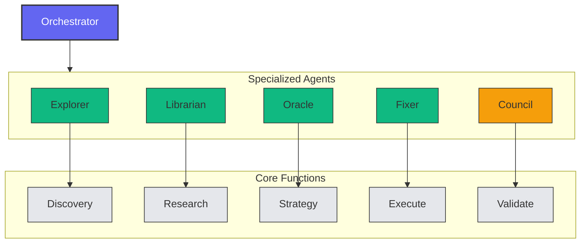
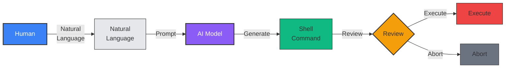
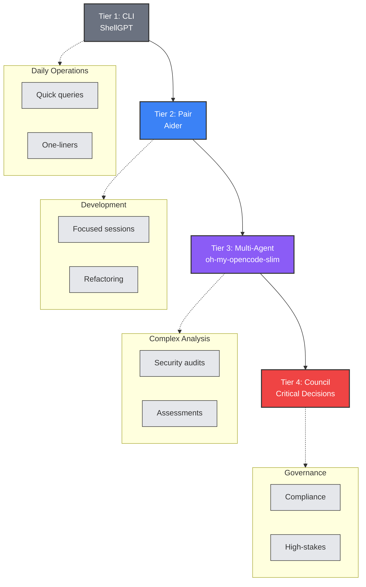
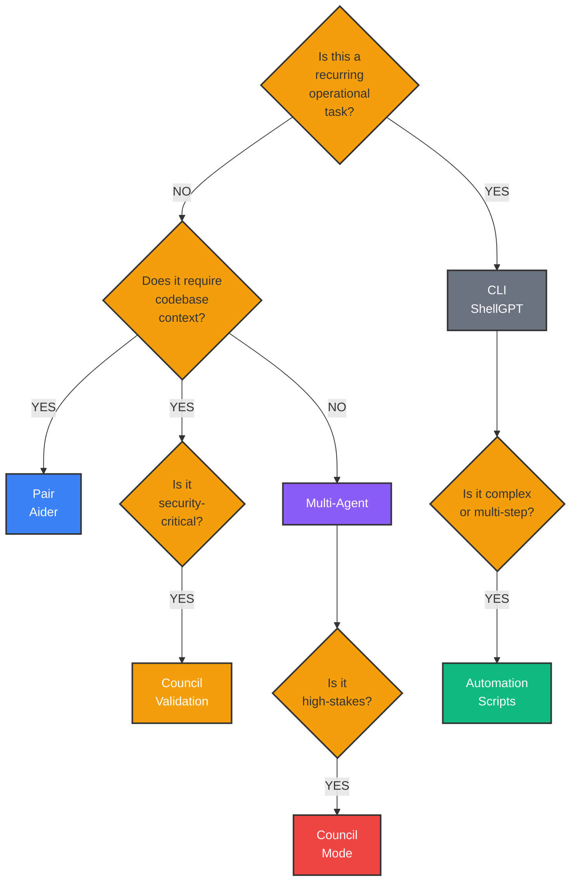


Start with the simplest paradigm that fits your task. Use CLI for quick commands, pair programming for focused development, and multi-agent for complex security audits.



All security-critical decisions require human approval. Enable Council mode for high-stakes changes and never auto-execute destructive operations in production.


## Overview

Three primary paradigms have emerged for integrating AI assistants into DevSecOps workflows. Each offers distinct trade-offs between automation, control, and security.

---

## Paradigm 1: Orchestrated Multi-Agent (The Pantheon)

### Philosophy
**Divide and conquer**: Specialized agents handle specific aspects of security workflows, coordinated by a central orchestrator.

### Architecture


### When to Use

**Best for:**
- Complex security audits across multiple domains
- Compliance assessments requiring research + analysis
- Architecture reviews with risk assessment
- Multi-step remediation workflows
- High-stakes decisions requiring validation

**Not for:**
- Simple, one-off commands
- Quick troubleshooting
- Real-time incident response (can be too slow)
- Resource-constrained environments

### Workflow Example: Vulnerability Management

```
1. Explorer scouts the codebase
   "Find all Dockerfiles and package.json files"
   → Discovers 15 containers, 8 Node.js apps

2. Librarian researches threats
   "Check CVE database for recent Node.js vulnerabilities"
   → Finds 3 critical CVEs affecting current versions

3. Oracle assesses risk
   "Prioritize remediation based on exploitability"
   → Ranks by CVSS + exposure

4. Fixer implements fixes
   "Update vulnerable dependencies, test builds"
   → Creates PRs with updates

5. Council validates approach
   "Review: Is upgrading the best fix vs. patching?"
   → Confirms upgrade path
```

### Strengths

| Strength | Description |
|----------|-------------|
| **Expertise depth** | Each agent optimized for specific tasks |
| **Cost efficiency** | Cheap models for scouting, expensive for decisions |
| **Parallelization** | Multiple agents work simultaneously |
| **Auditability** | Clear delegation chains |
| **Consensus** | Council mode reduces false positives |

### Weaknesses

| Weakness | Mitigation |
|----------|------------|
| **Complexity** | Start with 2-3 agents, expand gradually |
| **Latency** | Use for async tasks, not real-time ops |
| **Overhead** | Skip multi-agent for simple tasks |
| **Debugging** | Log all agent communications |

### Tools
- **oh-my-opencode-slim** (primary)
- **Custom multi-agent frameworks**

---

## Paradigm 2: Single-Agent Pair Programming

### Philosophy
**Deep collaboration**: One AI assistant works alongside the engineer with full context and continuous interaction.

### Architecture
```mermaid
flowchart LR
    subgraph Human [Human Engineer]
        direction TB
        H[Engineer]:::human
    end

    subgraph AI [AI Assistant]
        direction TB
        AI[AI Assistant]:::ai
    end

    subgraph Context [Shared Context]
        direction TB
        C[Codebase]:::context
        T[Terminal]:::context
        D[Docs]:::context
    end

    H <-->|Continuous<br/>Collaboration| AI
    H <-->|Read/Write| Context
    AI <-->|Read/Write| Context

    style H fill:#3b82f6,stroke:#333,stroke-width:2px,color:#fff
    style AI fill:#8b5cf6,stroke:#333,stroke-width:2px,color:#fff
    style C fill:#e5e7eb,stroke:#333,stroke-width:1px
    style T fill:#e5e7eb,stroke:#333,stroke-width:1px
    style D fill:#e5e7eb,stroke:#333,stroke-width:1px
```

### When to Use

**Best for:**
- Focused development sessions
- Incident response requiring rapid iteration
- Complex refactoring with safety checks
- Learning and exploration
- Code review and explanation

**Not for:**
- Automated scanning (needs human present)
- Bulk operations across many files
- Unattended execution

### Workflow Example: Security Incident Response

```
Human: "We have a potential SQL injection in the auth service"

Aider: "I'll help investigate. Let me first find the auth service code."
  → Maps codebase, finds auth/ directory

Aider: "Found the issue in auth/login.py line 42. 
       It's using string concatenation for SQL queries."

Human: "Show me the vulnerable code and suggest a fix"

Aider: "Current code: query = 'SELECT * FROM users WHERE id = ' + user_id
       Fix: Use parameterized queries
       ```python
       cursor.execute('SELECT * FROM users WHERE id = %s', (user_id,))
       ```"

Human: "Apply the fix and add tests"

Aider: "Done. I've:
       1. Fixed the SQL injection in login.py
       2. Added parameterized query test
       3. Created commit with security fix message
       
       Would you like me to scan for similar issues?"
```

### Strengths

| Strength | Description |
|----------|-------------|
| **Context depth** | Maintains conversation history |
| **Safety** | Git integration for easy rollback |
| **Responsiveness** | Real-time collaboration |
| **Learning** | Explains reasoning and decisions |
| **Focus** | Stays on task without distraction |

### Weaknesses

| Weakness | Mitigation |
|----------|------------|
| **Single-threaded** | No parallel analysis |
| **Limited research** | No external documentation lookup |
| **Scope limits** | Works best on focused tasks |
| **Availability** | Requires human presence |

### Tools
- **Aider** (primary)
- **Claude Code**
- **GitHub Copilot Chat**

---

## Paradigm 3: CLI Command Generation

### Philosophy
**Frictionless execution**: Natural language to shell commands with minimal overhead.

### Architecture


### When to Use

**Best for:**
- Daily operations and routine tasks
- Quick troubleshooting
- Command syntax lookup
- Log analysis
- One-off infrastructure queries

**Not for:**
- Complex multi-step workflows
- Security-critical decisions
- Code modifications
- Unsupervised automation

### Workflow Example: Daily Operations

```bash
# Quick command generation
$ sgpt -s "find all Docker containers using more than 500MB memory"
→ docker ps --format "table {{.Names}}\t{{.MemUsage}}" | awk '$2 > 500'
[E]xecute, [D]escribe, [A]bort: e

# Log analysis
$ kubectl logs -n production deployment/api | sgpt "find 5xx errors and group by endpoint"
→ Analyzing... Found:
   - /api/v1/users: 45 errors
   - /api/v1/orders: 12 errors
   
# Complex one-liners  
$ sgpt -s "backup all .env files to timestamped directory"
→ mkdir -p backup_$(date +%Y%m%d_%H%M%S) && find . -name ".env" -exec cp {} backup_*/ \;
```

### Strengths

| Strength | Description |
|----------|-------------|
| **Speed** | Fastest response time |
| **Simplicity** | Minimal setup and learning curve |
| **Composability** | Pipes well with Unix tools |
| **Low cost** | Simple queries, cheap models |
| **Ubiquity** | Works anywhere with shell access |

### Weaknesses

| Weakness | Mitigation |
|----------|------------|
| **Security risk** | Always review before execution |
| **No context** | No codebase awareness |
| **Limited analysis** | Surface-level insights |
| **Stateless** | No memory between commands |

### Tools
- **ShellGPT** (primary)
- **AIChat**
- **Warp Terminal AI**

---

## Comparative Analysis

### By Task Type

| Task | Multi-Agent | Pair | CLI |
|------|-------------|------|-----|
| **Security audit** | ⭐⭐⭐ | ⭐⭐ | ⭐ |
| **Incident response** | ⭐ | ⭐⭐⭐ | ⭐⭐ |
| **Daily operations** | ⭐ | ⭐⭐ | ⭐⭐⭐ |
| **Architecture review** | ⭐⭐⭐ | ⭐⭐ | ⭐ |
| **Code refactoring** | ⭐⭐ | ⭐⭐⭐ | ⭐ |
| **Log analysis** | ⭐⭐ | ⭐⭐ | ⭐⭐⭐ |
| **Compliance docs** | ⭐⭐⭐ | ⭐ | ⭐ |
| **Quick commands** | ⭐ | ⭐⭐ | ⭐⭐⭐ |

### By Team Context

| Context | Recommended | Secondary |
|---------|-------------|-----------|
| **Startup (1-3 people)** | CLI + Pair | - |
| **Small team (3-10)** | Pair | CLI |
| **Mid-size (10-50)** | Multi-Agent | Pair |
| **Enterprise (50+)** | Multi-Agent | All three |
| **Consulting** | CLI + Pair | Multi-Agent |
| **Security-focused** | Multi-Agent | Pair |

### By Security Posture

| Posture | Primary | Fallback |
|---------|---------|----------|
| **High-security (gov)** | Local models + Pair | Manual review |
| **Enterprise** | Multi-Agent + Council | Pair |
| **Standard** | Pair | CLI |
| **Fast-paced** | CLI | Pair |

---

## Hybrid Approaches

### The Tiered Model


### Implementation Strategy

**Week 1-2: CLI Foundation**
```bash
# Install ShellGPT
pip install shell-gpt

# Create security roles
sgpt --create-role aws_ops
sgpt --create-role k8s_debug

# Establish review habits
alias sgpt='sgpt --no-execute'  # Always review first
```

**Week 3-4: Add Pair Programming**
```bash
# Install Aider
pip install aider-chat

# Configure for security
export AIDER_SECURITY_MODE=strict

# Use for focused sessions
aider --model gpt-5.4 --security-mode strict
```

**Month 2: Multi-Agent for Teams**
```bash
# Install orchestration
bunx oh-my-opencode-slim@latest install

# Configure agents
# - Explorer for asset discovery
# - Oracle for architecture review
# - Fixer for remediation

# Team workflows
make security-audit  # Runs full multi-agent assessment
```

**Month 3: Governance Layer**
```yaml
# Add approval workflows
security-tier-4:
  requires: security-lead-approval
  uses: council-mode
  models: [gpt-5.4, claude-3.5, gemini-1.5]
  consensus: 2-of-3
```

---

## Migration Paths

### From Manual → CLI

**Challenge:** Breaking muscle memory  
**Strategy:**
1. Keep cheat sheet of common AI translations
2. Use AI for syntax lookup initially
3. Gradually expand to complex commands

### From CLI → Pair

**Challenge:** Context switching  
**Strategy:**
1. Use CLI for ops, Pair for development
2. Define clear boundaries
3. Maintain both skill sets

### From Pair → Multi-Agent

**Challenge:** Complexity increase  
**Strategy:**
1. Start with 2-3 agents
2. Use default configurations
3. Add customization gradually

---

## Anti-Patterns

### 1. The Silver Bullet
**Mistake:** Using one paradigm for everything  
**Fix:** Match paradigm to task complexity

### 2. Premature Orchestration
**Mistake:** Multi-agent for simple tasks  
**Fix:** Start simple, add complexity only when needed

### 3. The Yolo Operator
**Mistake:** Executing AI commands without review  
**Fix:** Mandatory review step, especially in production

### 4. Context Starvation
**Mistake:** CLI for tasks needing codebase context  
**Fix:** Use Pair or Multi-Agent when context matters

### 5. Over-Automation
**Mistake:** Removing humans from critical decisions  
**Fix:** Council mode for high-stakes, human approval required

---

## Decision Framework


---

## Conclusion

No single paradigm is universally superior. Effective DevSecOps teams:

1. **Master all three** at basic proficiency
2. **Default to simplest** paradigm that fits the task
3. **Escalate complexity** when warranted
4. **Maintain security controls** across all paradigms
5. **Review and iterate** on workflow effectiveness

The future likely involves seamless transitions between paradigms based on context, with AI itself determining the optimal approach.
