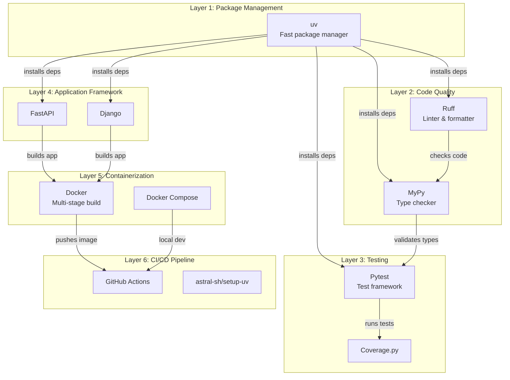
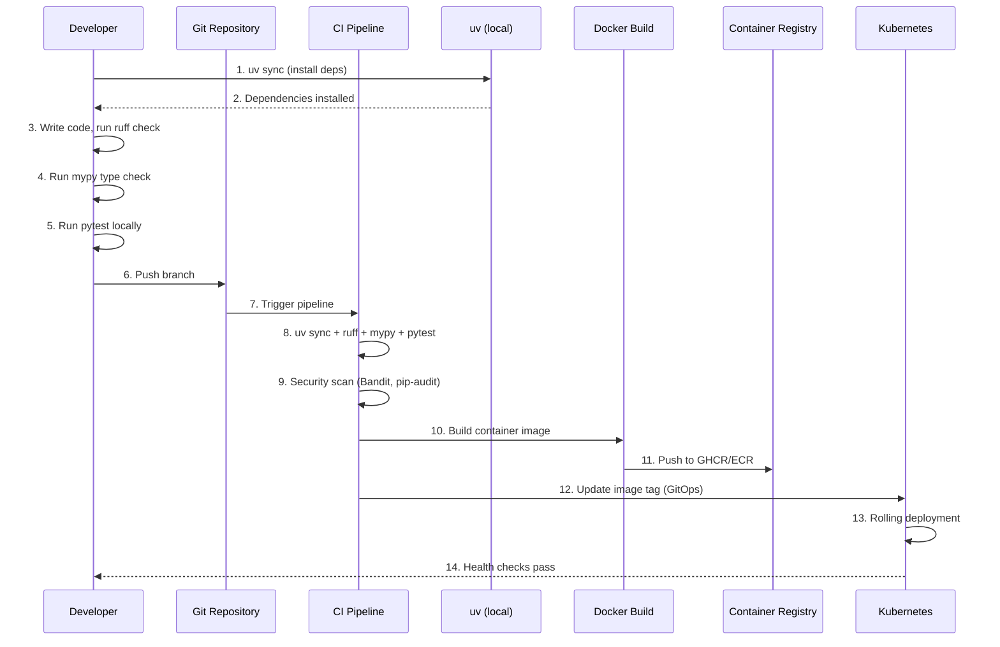
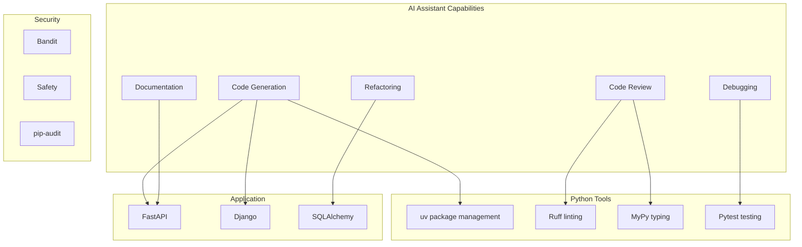

# Modern Python Developer: Comprehensive Workflow Guide

> **Stack**: uv · Ruff · MyPy · Pytest · FastAPI/Django · Docker

---

## Table of Contents

1. [Stack Overview](#1-stack-overview)
2. [Developer Daily Workflow](#2-developer-daily-workflow)
3. [Project Structure](#3-project-structure)
4. [Dependency Management](#4-dependency-management)
5. [Code Quality](#5-code-quality)
6. [Testing Workflow](#6-testing-workflow)
7. [CI/CD Integration](#7-cicd-integration)
8. [Containerization](#8-containerization)
9. [Security Considerations](#9-security-considerations)
10. [AI Assistant Integration](#10-ai-assistant-integration)
11. [Appendix A: Quick Reference](#appendix-a-quick-reference)
12. [Appendix B: Resources](#appendix-b-resources)

---

## 1. Stack Overview

### How These Tools Work Together

This stack represents a complete Python development-to-deployment pipeline. Each tool occupies a distinct layer in the development hierarchy:



### Tool Responsibilities

| Tool | Layer | Primary Responsibility | Key Strength |
|------|-------|----------------------|--------------|
| **uv** | Package Management | Fast dependency resolution, lock file management, virtualenv creation | 10-100x faster than pip, deterministic builds |
| **Ruff** | Code Quality | Linting, formatting, auto-fixing, import sorting | Written in Rust, 10-100x faster than existing tools |
| **MyPy** | Type Checking | Static type validation, catch type errors before runtime | Integrates with IDEs, extensive type stubs |
| **Pytest** | Testing | Unit/integration testing, fixtures, parametrization | Rich plugin ecosystem, excellent reporting |
| **FastAPI** | Web Framework | Modern async API development, auto-generated OpenAPI | Type annotations, automatic docs, async-first |
| **Django** | Web Framework | Full-stack web development, ORM, admin | Batteries-included, mature ecosystem |
| **Docker** | Containerization | Application packaging, reproducible environments | Multi-stage builds, minimal final images |

### When to Use FastAPI vs Django

| Criteria | FastAPI | Django |
|----------|---------|--------|
| **Use Case | Microservices, APIs, async workloads | Full-stack web apps, CMS, admin interfaces |
| **Learning Curve | Low (Pythonic, annotation-driven) | Medium (more conventions to learn) |
| **Performance | Excellent (async, Uvicorn) | Good (sync, Gunicorn + async workers) |
| **Data Layer | SQLAlchemy, Tortoise ORM (optional) | Built-in ORM (Django ORM) |
| **Admin | Manual (via libraries) | Built-in admin interface |
| **API Docs | Auto-generated (Swagger/ReDoc) | DRF (optional) |
| **Best For | ML services, REST APIs, real-time apps | Content sites, SaaS, enterprise apps |

> **Recommendation**: Use **FastAPI** for microservices, APIs, and async workloads. Use **Django** when you need the admin interface, built-in auth, or a full-stack framework with opinionated structure.

---

## 2. Developer Daily Workflow

### End-to-End Flow: Code Change to Production



### Daily Developer Checklist

| Time | Activity | Tools Used |
|------|----------|-----------|
| **Morning** | Check CI/CD pipeline for overnight failures | GitHub Actions, Slack |
| | Review dependabot PRs for vulnerability updates | Dependabot, GitHub |
| **Development** | `uv sync` to update dependencies | uv |
| | Run `ruff check --fix` for linting | Ruff |
| | Run `mypy` for type checking | MyPy |
| | Run `pytest` for local testing | Pytest |
| **Code Review** | Push branch, open PR | GitHub/GitLab |
| | Review CI results (lint, test, security) | CI dashboard |
| | Address Ruff auto-fixes | Ruff |
| **Deployment** | Merge to main (triggers deploy) | Git |
| | Monitor container health | Docker, K8s |
| | Check application logs | Loki, Grafana, ELK |
| **Security** | Review pip-audit/Trivy findings | CI output |
| | Update vulnerable dependencies | uv, Dependabot |

---

## 3. Project Structure

### Recommended Directory Layout

```
my-python-project/
├── src/
│   └── my_package/
│       ├── __init__.py
│       ├── main.py
│       ├── api/
│       │   ├── __init__.py
│       │   └── routes.py
│       ├── models/
│       │   ├── __init__.py
│       │   └── user.py
│       ├── services/
│       │   ├── __init__.py
│       │   └── business_logic.py
│       └── utils/
│           ├── __init__.py
│           └── helpers.py
├── tests/
│   ├── __init__.py
│   ├── conftest.py
│   ├── unit/
│   │   ├── __init__.py
│   │   └── test_services.py
│   ├── integration/
│   │   ├── __init__.py
│   │   └── test_api.py
│   └── fixtures/
│       └── sample_data.json
├── pyproject.toml
├── uv.lock
├── .ruff.toml
├── mypy.ini
├── Dockerfile
├── docker-compose.yml
├── .pre-commit-config.yaml
└── README.md
```

### Complete pyproject.toml Example

```toml
[project]
name = "my-python-project"
version = "0.1.0"
description = "A modern Python application"
readme = "README.md"
requires-python = ">=3.11"
license = { text = "MIT" }
authors = [
    { name = "Developer Name", email = "dev@example.com" }
]
keywords = ["python", "fastapi", "api"]
classifiers = [
    "Development Status :: 4 - Beta",
    "Intended Audience :: Developers",
    "License :: OSI Approved :: MIT License",
    "Programming Language :: Python :: 3.11",
    "Programming Language :: Python :: 3.12",
    "Programming Language :: Python :: 3.13",
]

dependencies = [
    "fastapi>=0.109.0",
    "uvicorn[standard]>=0.27.0",
    "pydantic>=2.5.0",
    "pydantic-settings>=2.1.0",
    "sqlalchemy>=2.0.0",
    "asyncpg>=0.29.0",
    "alembic>=1.13.0",
    "python-jose[cryptography]>=3.3.0",
    "passlib[bcrypt]>=1.7.4",
    "python-multipart>=0.0.6",
    "httpx>=0.26.0",
]

[project.optional-dependencies]
dev = [
    "ruff>=0.1.0",
    "mypy>=1.8.0",
    "pytest>=8.0.0",
    "pytest-asyncio>=0.23.0",
    "pytest-cov>=4.1.0",
    "pytest-mock>=3.12.0",
    "bandit>=1.7.0",
    "safety>=3.0.0",
    "pre-commit>=3.6.0",
    "httpx>=0.26.0",
]
test = [
    "pytest>=8.0.0",
    "pytest-asyncio>=0.23.0",
    "pytest-cov>=4.1.0",
    "pytest-mock>=3.12.0",
    "httpx>=0.26.0",
]

[project.scripts]
my-app = "my_package.main:app"

[build-system]
requires = ["hatchling"]
build-backend = "hatchling.build"

[tool.ruff]
target-version = "py311"
line-length = 100
indent-width = 4

[tool.ruff.lint]
select = [
    "E",   # pycodestyle errors
    "W",   # pycodestyle warnings
    "F",   # pyflakes
    "I",   # isort
    "N",   # pep8-naming
    "UP",  # pyupgrade
    "B",   # flake8-bugbear
    "C4",  # flake8-comprehensions
    "SIM", # flake8-simplify
    "RUF", # ruff-specific rules
]
ignore = [
    "E501",  # line too long (handled by formatter)
    "B008",  # do not perform function calls in argument defaults
    "C901",  # too complex (consider refactoring)
]

[tool.ruff.lint.per-file-ignores]
"__init__.py" = ["F401"]
"tests/*" = ["B011", "S101"]

[tool.ruff.format]
quote-style = "double"
indent-style = "space"
skip-magic-trailing-comma = false
line-ending = "auto"

[tool.mypy]
python_version = "3.11"
strict = true
warn_return_any = true
warn_unused_configs = true
disallow_untyped_defs = true
disallow_incomplete_defs = true
check_untyped_defs = true
no_implicit_optional = true
warn_redundant_casts = true
warn_unused_ignores = true
warn_no_return = true
follow_imports = "normal"
ignore_missing_imports = true

[[tool.mypy.overrides]]
module = "httpx.*"
ignore_missing_imports = true

[[tool.mypy.overrides]]
module = "pydantic.*"
ignore_missing_imports = true

[[tool.mypy.overrides]]
module = "sqlalchemy.*"
ignore_missing_imports = true

[tool.pytest.ini_options]
minversion = "8.0"
addopts = "-ra -q --strict-markers --tb=short"
testpaths = ["tests"]
pythonpath = ["."]
python_files = ["test_*.py"]
python_classes = ["Test*"]
python_functions = ["test_*"]
asyncio_mode = "auto"
asyncio_default_fixture_loop_scope = "function"

markers = [
    "slow: marks tests as slow (deselect with '-m \"not slow\"')",
    "integration: marks tests as integration tests",
    "unit: marks tests as unit tests",
    "security: marks tests as security tests",
]

[tool.coverage.run]
source = ["src"]
branch = true
omit = [
    "*/tests/*",
    "*/test_*.py",
    "*/__pycache__/*",
    "*/.venv/*",
]

[tool.coverage.report]
precision = 2
show_missing = true
skip_covered = false
exclude_lines = [
    "pragma: no cover",
    "def __repr__",
    "raise AssertionError",
    "raise NotImplementedError",
    "if __name__ == .__main__.:",
    "if TYPE_CHECKING:",
    "@abstractmethod",
]

[tool.bandit]
targets = ["src", "tests"]
exclude = ["tests/", ".venv/"]
skips = ["B101"]  # assert used (common in tests)

[tool.safety]
dependency-file = "pyproject.toml"
scan-args = "--full"

[tool.pre-commit]
default_stages = ["pre-commit"]
fail_fast = true

[tool.pre-commit.hooks]
ruff = { entry = "ruff", args = ["check", "--fix"] }
ruff-format = { entry = "ruff", format = "true" }
mypy = { entry = "mypy", args = ["src"] }
```

---

## 4. Dependency Management

### uv Commands Reference

| Command | Purpose | Example |
|---------|---------|---------|
| `uv init` | Initialize new project | `uv init my-project` |
| `uv add <package>` | Add dependency | `uv add fastapi` |
| `uv add --dev <package>` | Add dev dependency | `uv add --dev pytest` |
| `uv sync` | Sync lock file to environment | `uv sync` |
| `uv sync --all-extras` | Sync with all optional deps | `uv sync --all-extras` |
| `uv lock` | Generate/update lock file | `uv lock` |
| `uv run <command>` | Run command in project env | `uv run pytest` |
| `uv run --with <package> <command>` | Run with temp dependency | `uv run --with black black .` |
| `uv pip list` | List installed packages | `uv pip list` |
| `uv pip tree` | Show dependency tree | `uv pip tree` |
| `uv venv` | Create virtual environment | `uv venv .venv` |
| `uv venv --python 3.12` | Create with specific Python | `uv venv --python 3.12` |
| `uv remove <package>` | Remove dependency | `uv remove pytest` |
| `uv export` | Export requirements | `uv export -o requirements.txt` |

### uv vs pip vs Poetry Comparison

| Feature | uv | pip | Poetry |
|---------|-----|-----|--------|
| **Speed** | 10-100x faster | Baseline | 2-5x slower |
| **Lock file** | uv.lock | None (pip-lock) | poetry.lock |
| **Resolution** | Deterministic | May vary | Deterministic |
| **Virtualenv** | Built-in | Requires venv | Built-in |
| **Pyproject support** | Native | Partial | Native |
| **Build backend** | hatchling | setuptools | poetry-core |
| **Cross-platform** | Excellent | Excellent | Good |
| **Enterprise** | Growing | Standard | Good |
| **Security** | Audit integration | pip-audit | Limited |

> **Recommendation**: Use **uv** for all new projects. It's significantly faster, handles lock files properly, and integrates seamlessly with modern Python tooling. The speed difference is especially noticeable in CI/CD pipelines.

### uv Workflow in CI/CD

```yaml
# .github/workflows/ci.yml
name: CI

on: [push, pull_request]

jobs:
  test:
    runs-on: ubuntu-latest
    strategy:
      matrix:
        python-version: ["3.11", "3.12", "3.13"]

    steps:
      - uses: actions/checkout@v4

      - name: Install uv
        uses: astral-sh/setup-uv@v4
        with:
          enable-cache: true

      - name: Set up Python
        run: uv python install ${{ matrix.python-version }}

      - name: Install dependencies
        run: uv sync --all-extras

      - name: Run linters
        run: |
          uv run ruff check
          uv run ruff format --check
          uv run mypy

      - name: Run tests
        run: uv run pytest --cov

      - name: Upload coverage
        uses: codecov/codecov-action@v4
```

---

## 5. Code Quality

### Ruff: The Fast Python Linter

Ruff is 10-100x faster than existing linters because it's written in Rust. It can replace: flake8, isort, pyupgrade, autoflake, and more.

```bash
# Check all files
ruff check .

# Fix automatically fixable issues
ruff check --fix .

# Format code
ruff format .

# Check specific paths
ruff check src/ tests/

# Show statistics by rule
ruff check --statistics .

# Configure via pyproject.toml or .ruff.toml
```

### Pre-commit Hooks Configuration

```yaml
# .pre-commit-config.yaml
repos:
  - repo: https://github.com/astral-sh/ruff-pre-commit
    rev: v0.1.0
    hooks:
      - id: ruff
        args: [--fix]
      - id: ruff-format

  - repo: https://github.com/pre-commit/mirrors-mypy
    rev: v1.8.0
    hooks:
      - id: mypy
        additional_dependencies: [types-all]
        args: [--config-file=mypy.ini]
        files: ^src/

  - repo: https://github.com/pre-commit/pre-commit-hooks
    rev: v4.5.0
    hooks:
      - id: trailing-whitespace
      - id: end-of-file-fixer
      - id: check-yaml
      - id: check-added-large-files

  - repo: https://github.com/pycqa/bandit
    rev: 1.7.6
    hooks:
      - id: bandit
        args: [-c, pyproject.toml]
        files: ^src/
```

### MyPy Strict Mode Configuration

MyPy strict mode catches more errors but requires more type annotations:

```ini
# mypy.ini
[mypy]
python_version = 3.11
strict = True
warn_return_any = True
warn_unused_configs = True
disallow_untyped_defs = True
disallow_incomplete_defs = True
check_untyped_defs = True
no_implicit_optional = True
warn_redundant_casts = True
warn_unused_ignores = True
warn_no_return = True
show_error_codes = True
pretty = True

# For libraries, you might want to relax some rules
# [mypy-library.*]
# disallow_untyped_defs = False
```

### Common MyPy Patterns

```python
# Required for strict mode
from typing import TypedDict, NotRequired, Any, Protocol

# Class with typed attributes
class User:
    def __init__(self, name: str, email: str) -> None:
        self.name = name
        self.email = email

# TypedDict for structured dicts
class UserDict(TypedDict):
    name: str
    email: str
    age: NotRequired[int]  # Optional field

# Protocol for duck typing
class Renderable(Protocol):
    def render(self) -> str: ...

# Generic type aliases
type Matrix = list[list[float]]
type Callback[T] = Callable[[T], None]
```

---

## 6. Testing Workflow

### Pytest Structure and Fixtures

```python
# tests/conftest.py
import pytest
import asyncio
from typing import AsyncGenerator
from httpx import AsyncClient, ASGITransport
from sqlalchemy.ext.asyncio import create_async_engine, AsyncSession
from sqlalchemy.orm import sessionmaker

from my_package.main import app
from my_package.database import Base, get_db


# Database fixture
@pytest.fixture(scope="session")
def event_loop():
    """Create event loop for async tests."""
    loop = asyncio.get_event_loop_policy().new_event_loop()
    yield loop
    loop.close()


@pytest.fixture(scope="function")
async def db_engine():
    """Create test database engine."""
    engine = create_async_engine(
        "sqlite+aiosqlite:///:memory:",
        echo=False,
    )
    async with engine.begin() as conn:
        await conn.run_sync(Base.metadata.create_all)
    yield engine
    async with engine.begin() as conn:
        await conn.run_sync(Base.metadata.drop_all)
    await engine.dispose()


@pytest.fixture(scope="function")
async def db_session(db_engine) -> AsyncGenerator[AsyncSession, None]:
    """Create database session for tests."""
    async_session = sessionmaker(
        db_engine, class_=AsyncSession, expire_on_commit=False
    )
    async with async_session() as session:
        yield session


@pytest.fixture(scope="function")
async def client(db_session) -> AsyncGenerator[AsyncClient, None]:
    """Create test client."""

    async def override_get_db():
        yield db_session

    app.dependency_overrides[get_db] = override_get_db

    transport = ASGITransport(app=app)
    async with AsyncClient(transport=transport, base_url="http://test") as ac:
        yield ac

    app.dependency_overrides.clear()


@pytest.fixture
def sample_user() -> dict:
    """Sample user data for tests."""
    return {
        "username": "testuser",
        "email": "test@example.com",
        "password": "securepassword123",
    }
```

### Unit Tests Example

```python
# tests/unit/test_services.py
import pytest
from unittest.mock import AsyncMock, MagicMock
from my_package.services.user_service import UserService


class TestUserService:
    """Unit tests for UserService."""

    @pytest.mark.unit
    async def test_create_user_success(self, db_session, sample_user):
        """Test successful user creation."""
        service = UserService(db_session)
        user = await service.create_user(**sample_user)

        assert user.username == sample_user["username"]
        assert user.email == sample_user["email"]
        assert user.id is not None

    @pytest.mark.unit
    async def test_create_user_duplicate_email(self, db_session, sample_user):
        """Test duplicate email raises error."""
        service = UserService(db_session)
        await service.create_user(**sample_user)

        with pytest.raises(ValueError, match="Email already registered"):
            await service.create_user(
                username="other",
                email=sample_user["email"],
                password="otherpass",
            )

    @pytest.mark.unit
    async def test_get_user_by_id_not_found(self, db_session):
        """Test getting non-existent user returns None."""
        service = UserService(db_session)
        user = await service.get_user_by_id(999)
        assert user is None


@pytest.mark.parametrize("email,is_valid", [
    ("valid@example.com", True),
    ("also.valid@domain.co.uk", True),
    ("invalid", False),
    ("@domain.com", False),
    ("user@", False),
])
def test_email_validation(email: str, is_valid: bool):
    """Parametrized test for email validation."""
    from my_package.utils.validators import is_valid_email
    assert is_valid_email(email) is is_valid
```

### Integration Tests Example

```python
# tests/integration/test_api.py
import pytest
from httpx import AsyncClient


class TestHealthEndpoint:
    """Integration tests for health endpoint."""

    @pytest.mark.integration
    async def test_health_returns_200(self, client: AsyncClient):
        """Test health endpoint returns OK."""
        response = await client.get("/health")
        assert response.status_code == 200
        assert response.json()["status"] == "healthy"


class TestUserEndpoints:
    """Integration tests for user API endpoints."""

    @pytest.mark.integration
    async def test_create_user_success(self, client: AsyncClient, sample_user):
        """Test user creation via API."""
        response = await client.post("/api/v1/users", json=sample_user)
        assert response.status_code == 201
        data = response.json()
        assert data["username"] == sample_user["username"]
        assert data["email"] == sample_user["email"]
        assert "password" not in data

    @pytest.mark.integration
    async def test_create_user_invalid_email(self, client: AsyncClient):
        """Test user creation with invalid email."""
        response = await client.post(
            "/api/v1/users",
            json={
                "username": "test",
                "email": "invalid-email",
                "password": "password123",
            },
        )
        assert response.status_code == 422

    @pytest.mark.integration
    async def test_list_users(self, client: AsyncClient, sample_user):
        """Test listing users."""
        await client.post("/api/v1/users", json=sample_user)
        response = await client.get("/api/v1/users")
        assert response.status_code == 200
        assert len(response.json()) >= 1
```

### Async Testing with pytest-asyncio

```python
# tests/conftest.py - async configuration
import pytest

# Configure asyncio mode
pytest_plugins = ["pytest_asyncio"]


# tests/test_async.py
import pytest
import asyncio


@pytest.mark.asyncio
async def test_async_operation():
    """Basic async test."""
    result = await asyncio.sleep(0.1, result="done")
    assert result == "done"


@pytest.mark.asyncio
async def test_concurrent_operations():
    """Test concurrent async operations."""
    async def mock_api_call(delay: float, value: str) -> str:
        await asyncio.sleep(delay)
        return value

    results = await asyncio.gather(
        mock_api_call(0.1, "first"),
        mock_api_call(0.05, "second"),
        mock_api_call(0.15, "third"),
    )
    assert results == ["first", "second", "third"]
```

### Coverage Configuration

```bash
# Run with coverage
pytest --cov=src --cov-report=html --cov-report=term-missing

# Minimum coverage threshold
pytest --cov=src --cov-fail-under=80

# Generate XML for CI
pytest --cov=src --cov-report=xml
```

---

## 7. CI/CD Integration

### GitHub Actions: Complete CI Pipeline

```yaml
# .github/workflows/ci.yml
name: CI

on:
  push:
    branches: [main, develop]
  pull_request:
    branches: [main]

env:
  UV_SYSTEM_PYTHON: 1

jobs:
  # === PHASE 1: Lint & Type Check ===
  lint:
    runs-on: ubuntu-latest
    steps:
      - uses: actions/checkout@v4

      - name: Install uv
        uses: astral-sh/setup-uv@v4
        with:
          enable-cache: true
          cache-dependency-glob: "pyproject.toml"

      - name: Install dependencies
        run: uv sync --all-extras

      - name: Run Ruff
        run: uv run ruff check .

      - name: Run Ruff format check
        run: uv run ruff format --check .

      - name: Run MyPy
        run: uv run mypy src/

  # === PHASE 2: Security Scan ===
  security:
    runs-on: ubuntu-latest
    steps:
      - uses: actions/checkout@v4

      - name: Install uv
        uses: astral-sh/setup-uv@v4
        with:
          enable-cache: true

      - name: Install dependencies
        run: uv sync --all-extras

      - name: Run Bandit
        run: uv run bandit -r src/ -f json -o bandit.json
        continue-on-error: true

      - name: Run pip-audit
        run: uv pip audit || true

      - name: Upload Bandit results
        uses: actions/upload-artifact@v4
        with:
          name: bandit-results
          path: bandit.json

  # === PHASE 3: Test ===
  test:
    runs-on: ubuntu-latest
    strategy:
      matrix:
        python-version: ["3.11", "3.12", "3.13"]
        os: [ubuntu-latest]

    steps:
      - uses: actions/checkout@v4

      - name: Install uv
        uses: astral-sh/setup-uv@v4
        with:
          enable-cache: true
          cache-dependency-glob: "pyproject.toml"

      - name: Set up Python ${{ matrix.python-version }}
        run: uv python install ${{ matrix.python-version }}

      - name: Install dependencies
        run: uv sync --all-extras

      - name: Run pytest
        run: |
          uv run pytest \
            --cov=src \
            --cov-report=xml \
            --cov-report=term-missing \
            -v

      - name: Upload coverage to Codecov
        uses: codecov/codecov-action@v4
        with:
          file: ./coverage.xml
          flags: unittests
          name: python-${{ matrix.python-version }}

  # === PHASE 4: Build & Push ===
  build:
    needs: [lint, security, test]
    runs-on: ubuntu-latest
    if: github.event_name == 'push' && (github.ref == 'refs/heads/main' || startsWith(github.ref, 'refs/heads/release/'))

    steps:
      - uses: actions/checkout@v4

      - name: Set up Docker Buildx
        uses: docker/setup-buildx-action@v3

      - name: Login to Container Registry
        uses: docker/login-action@v3
        with:
          registry: ghcr.io
          username: ${{ github.actor }}
          password: ${{ secrets.GITHUB_TOKEN }}

      - name: Extract metadata
        id: meta
        uses: docker/metadata-action@v5
        with:
          images: ghcr.io/${{ github.repository }}
          tags: |
            type=ref,event=branch
            type=sha,prefix=
            type=semver,pattern={{version}}

      - name: Build and push
        uses: docker/build-push-action@v5
        with:
          context: .
          push: true
          tags: ${{ steps.meta.outputs.tags }}
          labels: ${{ steps.meta.outputs.labels }}
          cache-from: type=gha
          cache-to: type=gha,mode=max
          platforms: linux/amd64,linux/arm64
```

### GitHub Actions: Release Workflow

```yaml
# .github/workflows/release.yml
name: Release

on:
  push:
    tags:
      - 'v*'

jobs:
  build:
    runs-on: ubuntu-latest
    steps:
      - uses: actions/checkout@v4

      - name: Install uv
        uses: astral-sh/setup-uv@v4

      - name: Build package
        run: uv build

      - name: Check package
        run: uv pip install dist/*.whl

      - name: Publish to PyPI
        if: github.event_name == 'push' && startsWith(github.ref, 'refs/tags/v')
        env:
          PYPI_TOKEN: ${{ secrets.PYPI_TOKEN }}
        run: uv publish --token ${{ PYPI_TOKEN }}

      - name: Publish to Test PyPI
        if: github.event_name == 'push' && startsWith(github.ref, 'refs/tags/v')
        env:
          TEST_PYPI_TOKEN: ${{ secrets.TEST_PYPI_TOKEN }}
        run: uv publish --token ${{ env.TEST_PYPI_TOKEN }} --repository testpypi
```

### Matrix Testing Strategy

```yaml
# Matrix for comprehensive testing
strategy:
  matrix:
    python-version: ["3.11", "3.12", "3.13"]
    os: [ubuntu-latest, macos-latest, windows-latest]
    exclude:
      - os: windows-latest
        python-version: "3.13"  # Python 3.13 not yet on Windows
```

---

## 8. Containerization

### Multi-stage Dockerfile

```dockerfile
# Dockerfile
# Stage 1: Builder - install dependencies and build
FROM ghcr.io/astral-sh/uv:latest AS builder

WORKDIR /app

# Copy dependency files
COPY pyproject.toml uv.lock ./

# Install dependencies into virtual environment
RUN uv sync --no-dev --frozen --no-install-project

# Copy source code
COPY src/ ./src/

# Stage 2: Production - minimal runtime image
FROM python:3.11-slim-bookworm AS production

# Create non-root user
RUN groupadd --gid 1000 appgroup && \
    useradd --uid 1000 --gid appgroup --shell /bin/bash --create-home appuser

WORKDIR /app

# Copy virtual environment from builder
COPY --from=builder /app/.venv /app/.venv

# Copy application
COPY --from=builder /app/src /app/src

# Set environment
ENV PYTHONUNBUFFERED=1 \
    PYTHONDONTWRITEBYTECODE=1 \
    PATH="/app/.venv/bin:$PATH"

# Switch to non-root user
USER appuser

# Expose port
EXPOSE 8000

# Health check
HEALTHCHECK --interval=30s --timeout=10s --start-period=5s --retries=3 \
    CMD python -c "import urllib.request; urllib.request.urlopen('http://localhost:8000/health')"

# Run application
CMD ["uvicorn", "my_package.main:app", "--host", "0.0.0.0", "--port", "8000"]
```

### Security-hardened Dockerfile

```dockerfile
# Dockerfile with security best practices
FROM python:3.11-slim-bookworm AS base

# Install security updates
RUN apt-get update && \
    apt-get upgrade -y && \
    apt-get clean && \
    rm -rf /var/lib/apt/lists/*

# Create app user with specific UID/GID
RUN groupadd --gid 1000 appgroup && \
    useradd --uid 1000 --gid appgroup --shell /bin/false --create-home appuser

FROM base AS builder

WORKDIR /app
COPY pyproject.toml uv.lock ./
RUN uv sync --no-dev --frozen --no-install-project
COPY src/ ./src/

FROM base AS production

WORKDIR /app
COPY --from=builder /app/.venv /app/.venv
COPY --from=builder /app/src /app/src

# Environment variables for security
ENV PYTHONUNBUFFERED=1 \
    PYTHONDONTWRITEBYTECODE=1 \
    PYTHONHOME=/app/.venv \
    PATH="/app/.venv/bin:$PATH"

# Drop privileges
USER appuser

# Read-only filesystem friendly
ENV APP_HOME=/app
WORKDIR $APP_HOME

# No secrets in image
EXPOSE 8000
CMD ["uvicorn", "my_package.main:app", "--host", "0.0.0.0", "--port", "8000"]
```

### Docker Compose for Local Development

```yaml
# docker-compose.yml
services:
  app:
    build:
      context: .
      dockerfile: Dockerfile
      target: production
    ports:
      - "8000:8000"
    environment:
      - DATABASE_URL=postgresql+asyncpg://postgres:postgres@db:5432/mydb
      - REDIS_URL=redis://redis:6379/0
      - LOG_LEVEL=INFO
    depends_on:
      db:
        condition: service_healthy
      redis:
        condition: service_started
    volumes:
      - ./src:/app/src:ro
    restart: unless-stopped
    healthcheck:
      test: ["CMD", "python", "-c", "import urllib.request; urllib.request.urlopen('http://localhost:8000/health')"]
      interval: 30s
      timeout: 10s
      retries: 3

  db:
    image: postgres:15-alpine
    environment:
      - POSTGRES_USER=postgres
      - POSTGRES_PASSWORD=postgres
      - POSTGRES_DB=mydb
    volumes:
      - postgres_data:/var/lib/postgresql/data
    ports:
      - "5432:5432"
    healthcheck:
      test: ["CMD-SHELL", "pg_isready -U postgres"]
      interval: 10s
      timeout: 5s
      retries: 5

  redis:
    image: redis:7-alpine
    ports:
      - "6379:6379"
    volumes:
      - redis_data:/data
    command: redis-server --appendonly yes

volumes:
  postgres_data:
  redis_data:
```

### Docker Compose for Development

```yaml
# docker-compose.dev.yml
services:
  app:
    build:
      context: .
      dockerfile: Dockerfile.dev
    ports:
      - "8000:8000"
      - "5678:5678"  # Debug port
    environment:
      - DATABASE_URL=postgresql+asyncpg://postgres:postgres@db:5432/mydb
      - REDIS_URL=redis://redis:6379/0
      - LOG_LEVEL=DEBUG
    depends_on:
      db:
        condition: service_healthy
    volumes:
      - .:/app
      - /app/.venv  # Cache virtualenv
    command: uvicorn my_package.main:app --reload --host 0.0.0.0 --port 8000

  db:
    image: postgres:15-alpine
    environment:
      - POSTGRES_USER=postgres
      - POSTGRES_PASSWORD=postgres
      - POSTGRES_DB=mydb_dev
    volumes:
      - postgres_dev_data:/var/lib/postgresql/data
    ports:
      - "5432:5432"
    healthcheck:
      test: ["CMD-SHELL", "pg_isready -U postgres"]
      interval: 10s
      timeout: 5s
      retries: 5

  redis:
    image: redis:7-alpine
    ports:
      - "6379:6379"

volumes:
  postgres_dev_data:
```

```dockerfile
# Dockerfile.dev - Development stage
FROM python:3.11-slim-bookworm

WORKDIR /app

# Install uv
RUN pip install uv

# Copy files
COPY pyproject.toml uv.lock ./
COPY . .

# Install all dependencies including dev
RUN uv sync --all-extras

# Expose debug port
EXPOSE 8000 5678

# Run with reload
CMD ["uvicorn", "my_package.main:app", "--reload", "--host", "0.0.0.0", "--port", "8000"]
```

---

## 9. Security Considerations

> **Critical**: Python applications face unique security challenges including dependency vulnerabilities, dynamic typing risks, and supply chain attacks. This section covers essential DevSecOps practices for Python projects.

### 9.1 Python-specific SAST Tools

| Tool | Purpose | Key Strength |
|------|---------|--------------|
| **Bandit** | Security linting | Finds common security issues in Python code |
| **Semgrep** | Static analysis | Custom rules, multi-language support |
| **Safety** | Dependency scanning | Checks against known vulnerabilities |
| **pip-audit** | Dependency audit | Lists vulnerable packages |

```bash
# Run Bandit on source code
bandit -r src/ -f json -o bandit.json

# Run Safety check
safety check --json

# Run pip-audit
pip-audit --format=columns

# Run Semgrep
semgrep --config=auto --json --output=semgrep.json .
```

### 9.2 Secret Scanning

```yaml
# .github/workflows/secrets-scan.yml
name: Secret Scanning

on: [push, pull_request]

jobs:
  secrets-scan:
    runs-on: ubuntu-latest
    steps:
      - uses: actions/checkout@v4

      - name: Scan for secrets
        uses: trufflesecurity/trufflehog@main
        with:
          path: .
          base: ${{ github.event.repository.default_branch }}
          head: HEAD
          extra_args: --json > trufflehog-results.json
        continue-on-error: true

      - name: Upload results
        uses: actions/upload-artifact@v4
        with:
          name: secrets-scan-results
          path: trufflehog-results.json
```

### 9.3 Dependency Vulnerability Scanning in CI

```yaml
# Add to existing CI workflow
  security-scan:
    runs-on: ubuntu-latest
    steps:
      - uses: actions/checkout@v4

      - name: Install uv
        uses: astral-sh/setup-uv@v4

      - name: Sync dependencies
        run: uv sync --all-extras

      - name: Run pip-audit
        run: uv run pip-audit --format=json || true

      - name: Run Safety
        run: safety check --json > safety.json || true

      - name: Run Trivy vulnerability scan
        uses: aquasecurity/trivy-action@master
        with:
          scan-type: 'fs'
          scan-ref: '.'
          format: 'json'
          output: 'trivy.json'

      - name: Upload security reports
        uses: actions/upload-artifact@v4
        with:
          name: security-reports
          path: |
            safety.json
            trivy.json
```

### 9.4 Secure Dockerfile Practices

| Practice | Implementation | Why It Matters |
|----------|---------------|----------------|
| **Non-root user** | `USER appuser` | Prevents container escape with root |
| **Minimal base** | `python:3.11-slim-bookworm` | Reduces attack surface |
| **No secrets in layers** | Use runtime env vars or mounts | Prevents secret leakage via docker history |
| **Read-only filesystem** | `RUN chmod 444` where possible | Limits file system tampering |
| **Health checks** | `HEALTHCHECK` cmd | Enables container monitoring |
| **Multi-stage build** | Builder + production stages | Keeps build tools out of final image |

> **Warning**: Never bake secrets into Docker images. Use runtime environment variables, Kubernetes secrets, or external secret management (Vault, AWS Secrets Manager).

### 9.5 Least-privilege RBAC for Python Services in Kubernetes

```yaml
# kubernetes/rbac.yaml
apiVersion: v1
kind: ServiceAccount
metadata:
  name: python-app-sa
  namespace: python-app
---
apiVersion: rbac.authorization.k8s.io/v1
kind: Role
metadata:
  name: python-app-role
  namespace: python-app
rules:
  # Only allow reading specific configmaps needed by the app
  - apiGroups: [""]
    resources: ["configmaps"]
    resourceNames: ["python-app-config"]
    verbs: ["get", "list", "watch"]
  # Only allow reading own secrets
  - apiGroups: [""]
    resources: ["secrets"]
    resourceNames: ["python-app-secrets"]
    verbs: ["get"]
  # Allow reading pods for health checks
  - apiGroups: [""]
    resources: ["pods"]
    verbs: ["get", "list"]
---
apiVersion: rbac.authorization.k8s.io/v1
kind: RoleBinding
metadata:
  name: python-app-rolebinding
  namespace: python-app
subjects:
  - kind: ServiceAccount
    name: python-app-sa
    namespace: python-app
roleRef:
  kind: Role
  name: python-app-role
  apiGroup: rbac.authorization.k8s.io
```

### 9.6 Supply Chain Security

```yaml
# Verify container images with Cosign
- name: Verify image signature
  run: |
    cosign verify ghcr.io/${{ github.repository }}:${{ github.sha }} \
      --certificate-oidc-issuer=https://token.actions.githubusercontent.com \
      --certificate-identity=https://github.com/${{ github.repository }}/.github/workflows/ci.yml@refs/heads/main
```

| Practice | Implementation | Tool |
|----------|---------------|------|
| **Image signing** | Sign containers with Cosign | `cosign sign` |
| **SBOM generation** | Generate software bill of materials | `syft` |
| **SLSA verification** | Verify build provenance | `slsa-verifier` |
| **Trusted registries** | Use GHCR, ECR, or self-hosted | Registry configuration |
| **Hash verification** | Verify package hashes | `uv` (built-in) |

### 9.7 Security Checklist

| Area | Practice | Implementation |
|------|----------|---------------|
| **Dependencies** | Scan for vulnerabilities | pip-audit, Safety in CI |
| **Code** | SAST scanning | Bandit, Semgrep in CI |
| **Secrets** | Never commit secrets | Git hooks, secret scanning |
| **Images** | Scan container images | Trivy in CI |
| **Images** | Sign & verify | Cosign |
| **Images** | Non-root user | Dockerfile USER directive |
| **Images** | Minimal base | slim-bookworm |
| **Network** | Least privilege RBAC | K8s Role, not ClusterRole |
| **Supply chain** | SBOM generation | Syft |
| **Supply chain** | Hash verification | uv lock files |

> **Recommendation**: Enable Dependabot for automatic security updates to Python dependencies. Configure GitHub's secret scanning to detect accidentally committed secrets.

---

## 10. AI Assistant Integration

### How AI Assistants Enhance Python Development



### Agent Pantheon Mapping for Python Development

| Agent | Python Development Role | Example Tasks |
|-------|-------------------------|---------------|
| **Explorer** | Map Python attack surface | Find dependencies, secrets, exposed endpoints, vulnerable packages |
| **Librarian** | Research Python CVEs | Look up CVE details for Python packages, check Bandit rules |
| **Observer** | Monitor Python app health | Query app metrics, analyze error logs, create performance dashboards, set up SLO alerts |
| **Oracle** | Assess architecture security | Review FastAPI/Django security, evaluate auth patterns |
| **Fixer** | Auto-fix security issues | Fix Bandit findings, update vulnerable dependencies |
| **Designer** | Create compliance dashboards | Python dependency compliance, security metrics |
| **Council** | Validate security decisions | Multi-model consensus on risk acceptance |

### AI-Assisted Python Workflow

| Task | AI Assistant Role | Example Prompt |
|------|------------------|----------------|
| **Dependency management** | Explain and resolve conflicts | "Why is uv resolving these version conflicts? Here's my pyproject.toml..." |
| **Type annotations** | Add MyPy types | "Add type annotations to this function using strict MyPy mode" |
| **Test generation** | Create pytest tests | "Write pytest tests for this FastAPI endpoint with fixtures" |
| **Security review** | Run Bandit and explain | "Run Bandit on this code and explain the findings" |
| **Debugging** | Analyze tracebacks | "Here's a Python traceback. What's the root cause?" |
| **Performance** | Profile and optimize | "Profile this async code and suggest optimizations" |
| **Refactoring** | Improve code quality | "Refactor this to use better patterns, pass Ruff checks" |

### MCP Integrations for Python

```json
{
  "mcpServers": {
    "uv": {
      "command": "uv",
      "args": ["run", "python", "-m", "mcp_server"]
    },
    "pytest": {
      "command": "pytest",
      "args": ["--co", "-q"]
    },
    "docker": {
      "command": "docker",
      "args": ["ps"]
    }
  }
}
```

### Example Agent Prompts

**Explorer Agent**:
```
"Find all Python dependencies in this project and check for known CVEs. 
Also look for any hardcoded API keys or secrets in the codebase."
```

**Librarian Agent**:
```
"Research the latest security advisories for FastAPI and SQLAlchemy. 
What are the critical CVEs we need to address?"
```

**Oracle Agent**:
```
"Review this FastAPI application for security vulnerabilities. 
Check for: authentication, authorization, input validation, 
SQL injection, and dependency vulnerabilities."
```

**Observer Agent**:
```
"Query the Prometheus metrics for my FastAPI app — show me request latency
percentiles and error rates over the last hour. Also check if any alert rules
are firing for this namespace."
```

**Fixer Agent**:
```
"Fix all Bandit findings in this Python code. 
After fixing, run pytest to ensure tests still pass."
```

**Designer Agent**:
```
"Create a compliance dashboard showing: dependency vulnerabilities, 
code coverage trends, and security scan results over time."
```

---

## Appendix A: Quick Reference

### uv Commands

```bash
# Initialize project
uv init my-project
cd my-project

# Add dependencies
uv add fastapi uvicorn[standard]
uv add --dev pytest ruff mypy

# Install and lock
uv sync
uv sync --all-extras

# Run commands
uv run pytest
uv run ruff check .
uv run mypy src/

# Export requirements
uv export -o requirements.txt
```

### Ruff Commands

```bash
# Check and fix
ruff check .
ruff check --fix .

# Format
ruff format .

# Show statistics
ruff check --statistics

# List rules
ruff rule B001
```

### MyPy Commands

```bash
# Type check
mypy src/

# Strict mode
mypy --strict src/

# Show summary
mypy --pretty src/

# Ignore missing imports
mypy --ignore-missing-imports src/
```

### Pytest Commands

```bash
# Run all tests
pytest

# Run with coverage
pytest --cov=src --cov-report=html

# Run specific markers
pytest -m "not slow"
pytest -m "integration"

# Run in parallel
pytest -n auto

# Show slowest tests
pytest --durations=10
```

### Docker Commands

```bash
# Build image
docker build -t my-app:latest .

# Run container
docker run -p 8000:8000 my-app:latest

# Run with docker-compose
docker-compose up -d

# View logs
docker-compose logs -f app

# Rebuild
docker-compose build --no-cache
```

---

## Appendix B: Resources

### Official Documentation

- [uv Documentation](https://docs.astral.sh/uv/)
- [Ruff Documentation](https://docs.astral.sh/ruff/)
- [MyPy Documentation](https://mypy.readthedocs.io/)
- [Pytest Documentation](https://docs.pytest.org/)
- [FastAPI Documentation](https://fastapi.tiangolo.com/)
- [Django Documentation](https://docs.djangoproject.com/)
- [Docker Documentation](https://docs.docker.com/)

### Security Resources

- [Bandit Documentation](https://bandit.readthedocs.io/)
- [Safety Documentation](https://safety.readthedocs.io/)
- [pip-audit Documentation](https://pip-audit.readthedocs.io/)
- [OWASP Top 10](https://owasp.org/www-project-top-ten/)
- [Python Security Guide](https://python-security.readthedocs.io/)

### CI/CD Resources

- [GitHub Actions Documentation](https://docs.github.com/en/actions)
- [astral-sh/setup-uv Action](https://github.com/astral-sh/setup-uv)
- [Codecov Documentation](https://docs.codecov.io/)

### Container Security

- [Cosign Documentation](https://docs.sigstore.dev/cosign/)
- [Trivy Documentation](https://aquasecurity.github.io/trivy/)
- [Distroless Images](https://github.com/GoogleContainerTools/distroless)

---

> **Last Updated**: May 2026
> **Version**: 1.0.0
> **Maintainer**: DevSecOps Team