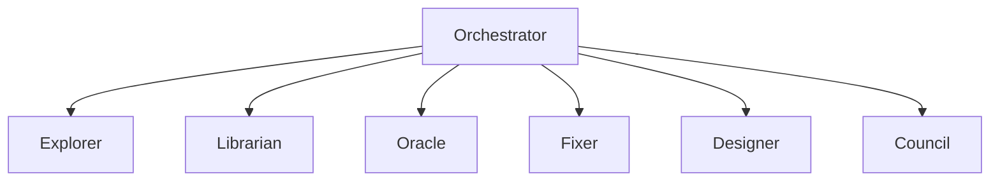

# Hugo Static Site Plan

> Proposal for publishing the AI-DevSecOps-Workflows documentation as a static site.

---

## 1. Generator Choice: Hugo

| Criterion | Hugo | Alternatives (Docusaurus, MkDocs, Jekyll) |
|-----------|------|-------------------------------------------|
| **Speed** | ~1ms/page (Go) | Docusaurus (Node) slower; Jekyll (Ruby) slower |
| **Theme Ecosystem** | 300+ themes | Docusaurus has fewer; MkDocs limited |
| **Markdown Native** | Goldmark (GFM + extras) | All support MD, but Hugo's is fastest |
| **DevSecOps Fit** | Great for tech docs | Docusaurus is React-heavy; MkDocs simpler |
| **CI/CD Friendly** | Single binary, easy container | Docusaurus needs Node install |

**Decision:** Hugo — fastest builds, best theme selection for tech docs, single binary deployment.

---

## 2. Recommended Theme: `hugo-book`

**Repository:** `alex-shpak/hugo-book`  
**License:** MIT  
**Stars:** 3k+

### Why `hugo-book`

- **Clean, minimal** — focus on content, not chrome
- **Built-in search** — Fuse.js client-side search
- ** collapsible menu** — perfect for multi-section docs
- **Dark mode** — essential for security engineers
- **Mermaid support** — for architecture diagrams
- **Multi-language ready** — i18n for future compliance translations
- **No JS framework bloat** — pure CSS + minimal JS

### Runner-up Themes

| Theme | Why Consider | Trade-off |
|-------|-------------|-----------|
| `docsy` (Google) | Enterprise look, built-in versioning | Heavy, Bootstrap dependency |
| `learn` (matcornic) | Similar to hugo-book, more colors | Less active maintenance |
| `geekdoc` | Modern, fast, great mobile | Smaller community |

---

## 3. Proposed Site Structure

```
website/
├── config.toml          # Hugo site config
├── content/
│   ├── _index.md        # Homepage
│   ├── docs/
│   │   ├── _index.md
│   │   ├── architecture.md
│   │   ├── frameworks.md
│   │   ├── paradigms.md
│   │   ├── research.md
│   │   ├── security.md
│   │   └── use-cases.md
│   ├── configs/
│   │   ├── _index.md
│   │   ├── oh-my-opencode-slim/
│   │   │   ├── _index.md
│   │   │   ├── devsecops.json.md
│   │   │   └── devsecops-go.json.md
│   │   ├── shellgpt/
│   │   │   ├── _index.md
│   │   │   ├── roles.md
│   │   │   └── sgptrc.md
│   │   └── security-policies/
│   │       ├── _index.md
│   │       └── ai-assistant-policy.md
│   ├── examples/
│   │   ├── _index.md
│   │   ├── iac-scanning.md
│   │   ├── incident-response.md
│   │   └── pipeline-security.md
│   └── agents.md        # AGENTS.md rendered as page
├── static/
│   ├── images/          # Diagrams, logos
│   └── favicon.ico
├── themes/
│   └── hugo-book/       # Git submodule
└── layouts/
    └── partials/        # Custom overrides (search, analytics)
```

---

## 4. Hugo Configuration (`config.toml`)

```toml
baseURL = 'https://ai-devsecops-workflows.dev'
languageCode = 'en-us'
title = 'AI-Assisted DevSecOps Workflows'
theme = 'hugo-book'

[params]
  BookTheme = 'auto'           # auto/light/dark
  BookToC = true               # Table of contents
  BookSearch = true            # Enable search
  BookRepo = 'https://github.com/adurrr/ai-devsecops-workflows'
  BookEditPath = 'edit/main/content'
  BookDateFormat = 'January 2, 2006'
  BookComments = false

[menu]
  [[menu.before]]
    name = "GitHub"
    url = "https://github.com/adurrr/ai-devsecops-workflows"
    weight = 10
```

---

## 5. Content Adaptation Plan

| Source File | Target Path | Adaptations |
|-------------|-------------|-------------|
| `README.md` | `content/_index.md` | Add front matter, call-to-action buttons |
| `docs/*.md` | `content/docs/*.md` | Add Hugo front matter (`title`, `weight`) |
| `AGENTS.md` | `content/agents.md` | Split into sections with anchors |
| `configs/*` | `content/configs/*` | Embed JSON/YAML with syntax highlighting |
| `examples/*.sh` | `content/examples/*.md` | Wrap in markdown with explanation |
| `LICENSE` | `content/license.md` | SPDX header reference |

### Front Matter Template

```yaml
---
title: "Architecture"
weight: 10
---
```

---

## 6. Diagram Rendering

### Mermaid.js for Architecture Diagrams

The repo already contains ASCII diagrams. These should be converted to Mermaid:



**Integration:** `hugo-book` supports Mermaid via `mermaid` shortcode or JS inclusion.

---

## 7. Search Strategy

| Approach | Tool | Coverage |
|----------|------|----------|
| **Client-side** | Fuse.js (built into hugo-book) | All content, instant |
| **Server-side** | Pagefind | Better ranking, larger sites |
| **External** | Algolia DocSearch | Requires API key, best UX |

**Recommendation:** Start with Fuse.js (hugo-book default). Escalate to Pagefind if content grows beyond 100 pages.

---

## 8. Deployment Options

| Platform | Complexity | Cost | Best For |
|----------|-----------|------|----------|
| **GitHub Pages** | Low | Free | Open source projects |
| **Cloudflare Pages** | Low | Free | Global CDN, custom domains |
| **Vercel** | Low | Free | Serverless functions later |
| **Netlify** | Low | Free | Forms, identity, edge functions |
| **Self-hosted (S3+CloudFront)** | Medium | ~$5/mo | Enterprise control |

**Recommendation:** Cloudflare Pages — free, fast global CDN, automatic HTTPS, custom domain support.

### CI/CD Pipeline (GitHub Actions)

```yaml
# .github/workflows/deploy-site.yml
name: Deploy Hugo Site
on:
  push:
    branches: [main]
    paths: ['website/**', 'docs/**', 'content/**']

jobs:
  deploy:
    runs-on: ubuntu-latest
    steps:
      - uses: actions/checkout@v4
        with:
          submodules: true
          fetch-depth: 0

      - name: Setup Hugo
        uses: peaceiris/actions-hugo@v3
        with:
          hugo-version: '0.145.0'
          extended: true

      - name: Build
        run: hugo --minify --source website

      - name: Deploy to Cloudflare Pages
        uses: cloudflare/pages-action@v1
        with:
          accountId: ${{ secrets.CF_ACCOUNT_ID }}
          projectName: ai-devsecops-workflows
          directory: website/public
          gitHubToken: ${{ secrets.GITHUB_TOKEN }}
```

---

## 9. Customization Checklist

- [ ] Add project logo to `static/images/logo.svg`
- [ ] Configure custom domain (`ai-devsecops-workflows.dev`)
- [ ] Add analytics (Plausible or Fathom — privacy-friendly)
- [ ] Configure OpenGraph / Twitter Cards
- [ ] Add "Edit this page" links pointing to GitHub
- [ ] Versioning strategy (for v1.0, v2.0 docs)
- [ ] Dark mode toggle customization
- [ ] Code block copy buttons
- [ ] JSON/YAML schema validation badges

---

## 10. Implementation Phases

### Phase 1: MVP (Week 1)

```bash
# 1. Initialize Hugo site
cd website
hugo new site .
git init
git submodule add https://github.com/alex-shpak/hugo-book.git themes/hugo-book

# 2. Copy adapted content
cp ../docs/*.md content/docs/
cp ../AGENTS.md content/agents.md

# 3. Build and verify
hugo server -D
```

### Phase 2: Polish (Week 2)

- Convert ASCII diagrams to Mermaid
- Add syntax highlighting for all code blocks
- Configure search and navigation
- Add custom CSS for DevSecOps branding

### Phase 3: Deploy (Week 3)

- Set up Cloudflare Pages project
- Configure custom domain and HTTPS
- Add GitHub Actions CI/CD
- Verify all links and search functionality

### Phase 4: Iterate (Ongoing)

- Add new docs as repo evolves
- Monitor search analytics
- Collect feedback via GitHub issues
- A/B test theme variations

---

## 11. Resources

- [Hugo Documentation](https://gohugo.io/documentation/)
- [hugo-book Theme Docs](https://github.com/alex-shpak/hugo-book)
- [Cloudflare Pages Docs](https://developers.cloudflare.com/pages/)
- [Mermaid Live Editor](https://mermaid.live/)
